# Animal Names with Animal Pictures

## List of Pets

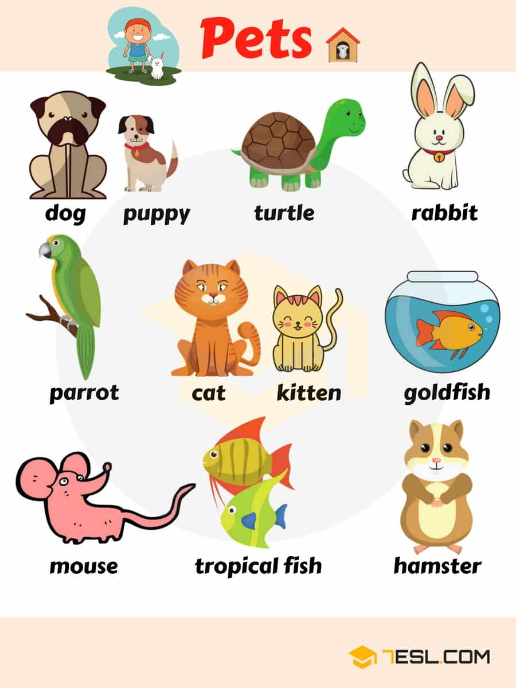

word | IPA
------------ | -------------
1. Dog | /dɑːɡ/
2. Puppy | /ˈpʌp.i/
3. Turtle |  /ˈtɝː.t̬əl/
4. Rabbit | /ˈræb.ɪt/
5. Parrot | /ˈper.ət/
6. Cat | /kæt/
7. Kitten | /ˈkɪt̬.ən/
8. Goldfish |   /ˈɡoʊld.fɪʃ/
9. Mouse |  /maʊs/
10. Tropical |   /ˈtrɑː.pɪ.kəl/ 
11. fish |  /fɪʃ/
12. Hamster |  /ˈhæm.stɚ/    

## Farm Animal Names

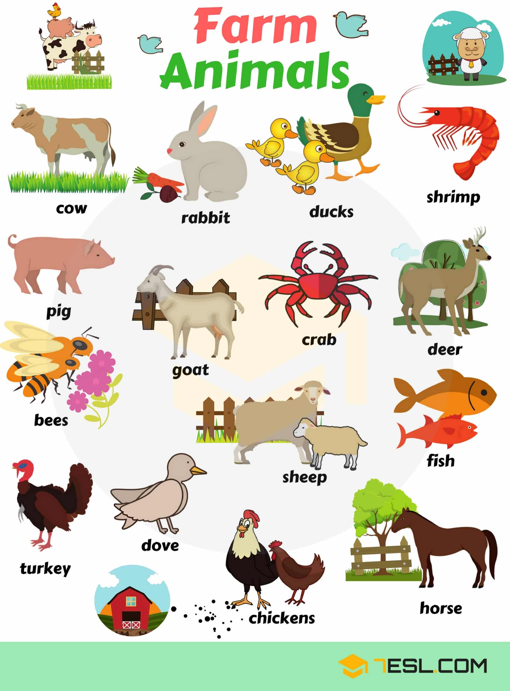

word | IPA
------------ | -------------
13. Cow | /kaʊ/
14. Rabbit | /ˈræb.ɪt/
15. Ducks | /dʌk/
16. Shrimp | /ʃrɪmp/
17. Pig | /pɪɡ/
18. Goat | /ɡoʊt/
19. Crab | /kræb/
20. Deer | /dɪr/
21. Bee | /biː/
22. Sheep | /ʃiːp/
23. Fish | /fɪʃ/
24. Turkey | /ˈtɝː.ki/
25. Dove | /dʌv/
26. Chicken | /ˈtʃɪk.ɪn/
27. Horse | /hɔːrs/
  
## List of Birds

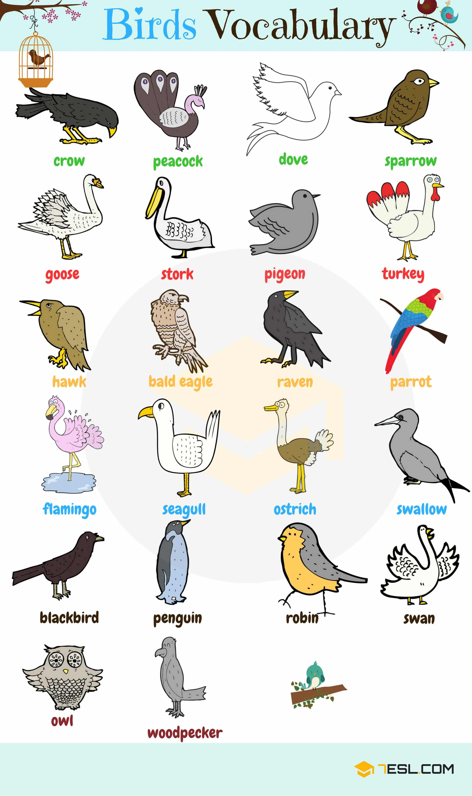

Crow
Peacock
Dove
Sparrow
Goose
Stork
Pigeon
Turkey
Hawk
Bald eagle
Raven
Parrot
Flamingo
Seagull
Ostrich
Swallow
Black bird
Penguin
Robin
Swan
Owl
Woodpecker

## Mammal Animal Names 

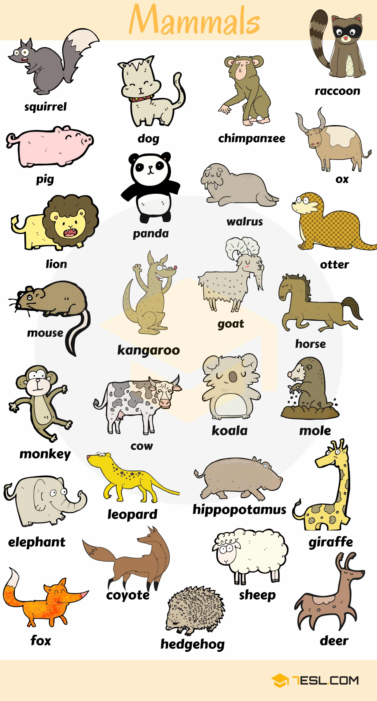

Squirrel
Dog
Chimpanzee
Ox
Lion
Panda
Walrus
Otter
Mouse
Kangaroo
Goat
Horse
Monkey
Cow
Koala
Mole
Elephant
Leopard
Hippopotamus
Giraffe
Fox
Coyote
Hedgehong
Sheep
Deer

## Wild Animal Names

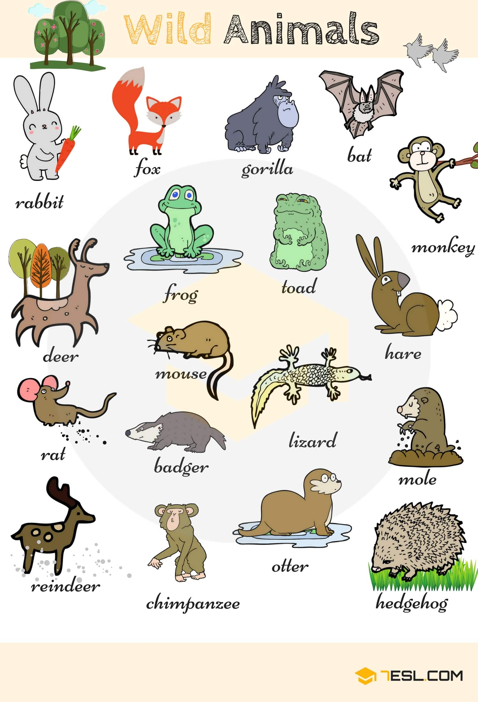

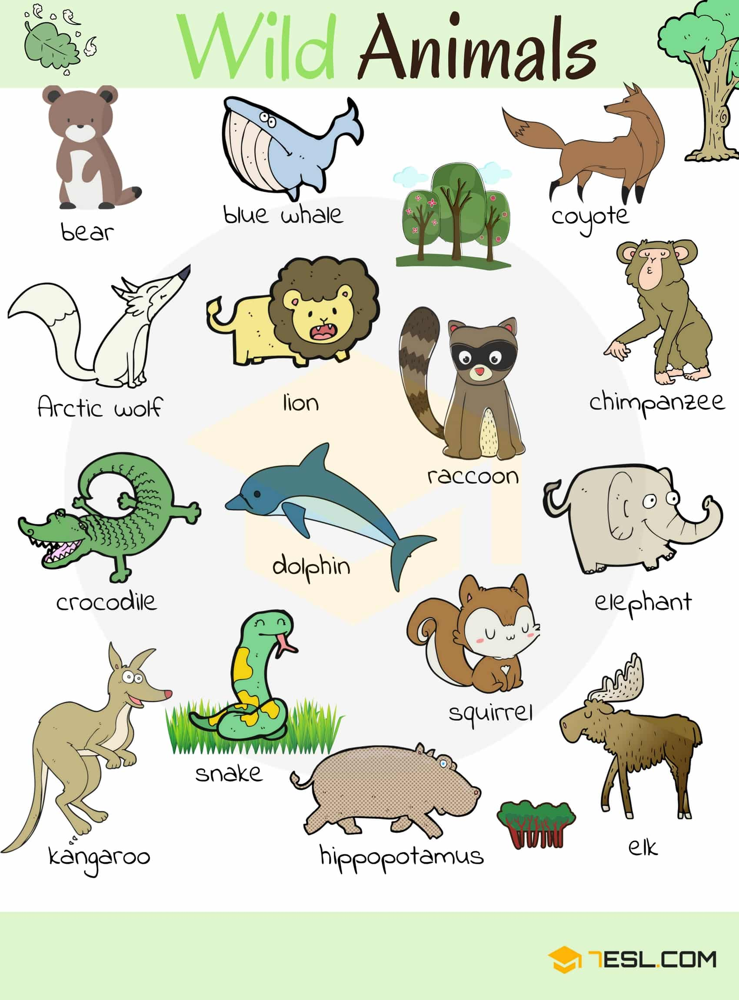

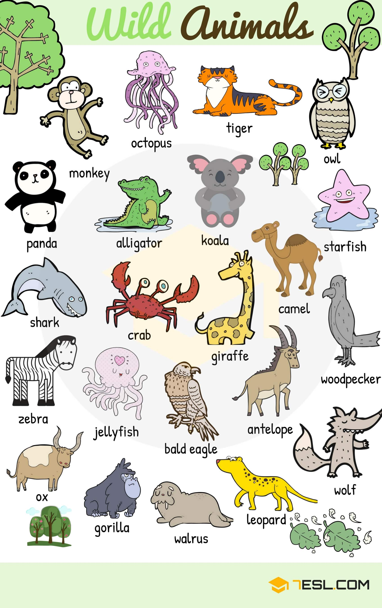

Giraffe
Woodpecker
Camel
Starfish
Koala
Alligator
Owl
Tiger
Bear
Blue whale
Coyote
Chimpanzee
Raccoon
Lion
Arctic wolf
Crocodile
Dolphin
Elephant
Squirrel
Snake
Kangaroo
Hippopotamus
Elk
Fox
Gorilla
Bat
Hare
Toad
Frog
Deer
Rat
Badger
Lizard
Mole
Hedgehog
Otter
Reindeer

## Sea Animal Names

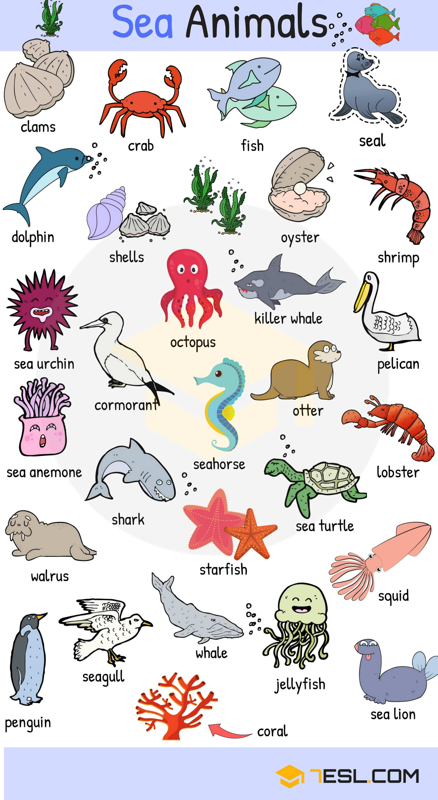

Crab
Fish
Seal
Octopus
Shark
Seahorse
Walrus
Starfish
Whale
Penguin
Jellyfish
Squid
Lobster
Pelican
Clams
Seagull
Dolphin
Shells
Sea urchin
Cormorant
Otter
Pelican
Sea anemone
Sea turtle
Sea lion
Coral

## Names of Insects

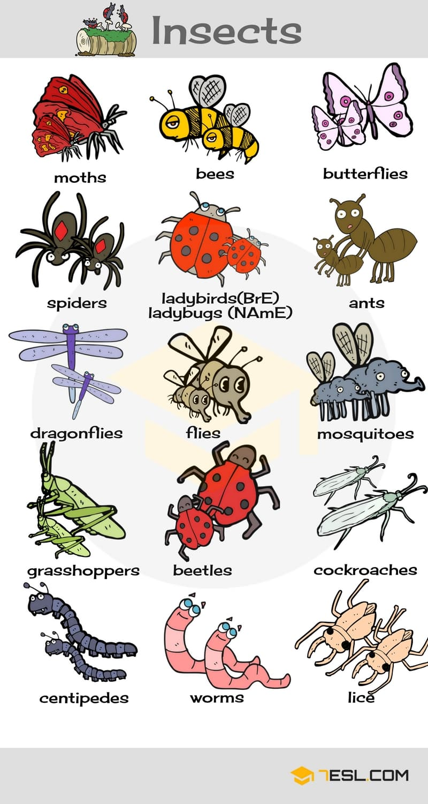

Moth
Bee
Butterfly
Spider
Ladybird (BrE) – ladybug (NAmE)
Ant
Dragonfly
Fly
Mosquito
Grasshopper
Beetle
Cockroach
Centipede
Worm
Louse

## Male, Female and Baby Animal Names

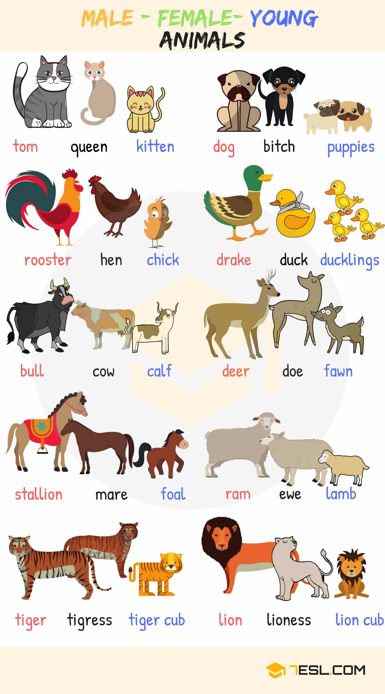

Cat
Tom – Queen – Kitten

Dog
Dog – Bitch – Puppy

Chicken
Rooster – Hen – Chick

Duck
Drake – Duck – Duckling

Ox
Bull – Cow – Calf

Deer
Deer – Doe – Fawn

Horse
Stallion – Mare – Foal

Sheep
Ram – Ewe – Lamb

Tiger
Tiger – Tigeress – Tiger cub

Lion
Lion – Lioness – Lion cub

## Names of Animal Groups Image

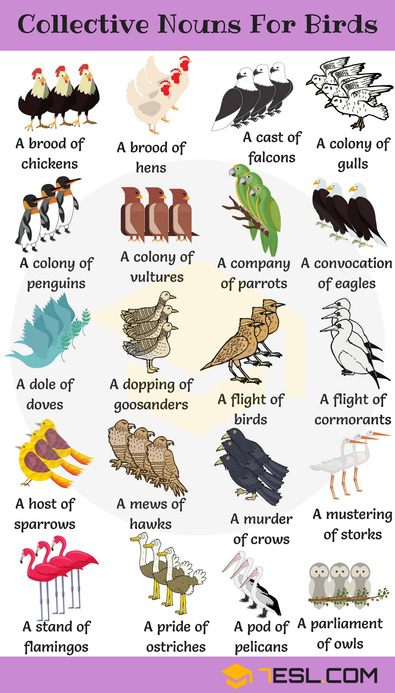

