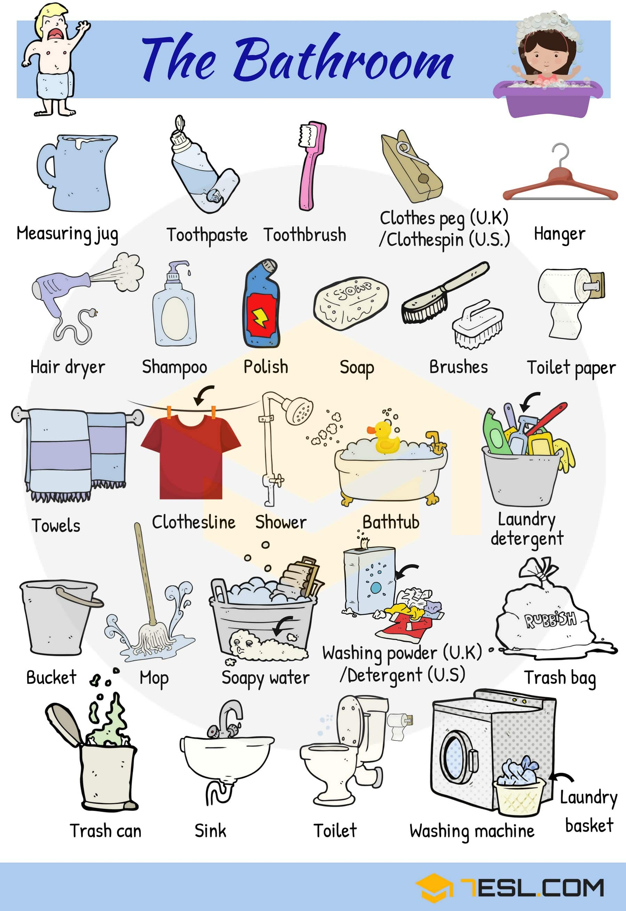

# Tools and Equipment 

## Bathroom Tools and Equipment

Word | IPA
------------ | -------------
Measuring jug
Toothpaste
Toothbrush
Soap
Clothes peg (U.K)/ Clothespin (U.S)
Hanger
Hair dryer
Shampoo
Polish
Brush
Toilet paper
Towel
Clothesline
Shower
Bathtub
Laundry detergent
Bucket
Mop
Soapy water
Washing powder (U.K)/ Detergent (U.S)
Trash bag
Trash can
Sink
Toilet
Washing machine
Laundry basket
Razor
Electric razor
Shaving cream
Mouthwash
Q-tip
Hair brush
Comb
Cleanser
Scale
Tissue
Bath toys
Faucet
Mirror
Bath mat

## Household Items: Cleaning and Laundry

Word | IPA
------------ | -------------
Dish towel
Iron
Ironing board
Scrub brush
Cloth
Sponge
Laundry soap/ Laundry detergent
Bleach
Liquid soap
Rubber gloves
Trash can
Broom
Dustpan
Mop
Squeegee mop
Hose
Bucket
Laundry basket
Washing machine

## Household Items: Appliances

Word | IPA
------------ | -------------
Coffee maker
Blender
Mixer
Toaster
Microwave
Crock pot
Rice cooker
Pressure cooker
Bachelor griller (U.K)
Stove
Lamp
Light bulb
Lantern
Torch
Clothes iron
Electric drill
Kettle
Water cooker (U.K)/ Electric kettle/ Hot pot (U.S)
Water purifier
Kitchen hood
Electric guitar
Vacuum cleaner
Electric fan
Evaporative cooler
Air conditioner
Oven
Dishwasher
Television
Speaker
Clothes dryer
Washing machine
Refrigerator

## Household Items: Devices and Equipment

Word | IPA
------------ | -------------
Aroma lamp
Beverage opener
Appliance plug
Paintbrush
Roller
Hair iron (U.K)/ Curling iron (U.S.)
Hair dryer
Toaster
Electric kettle/ Hot pot
Television
Stove
Small oven
Microwave oven
Evaporative cooler
Air conditioner
Vacuum cleaner
Water cooler
Clock
Sewing machine
Fan
Juicer
Clothes iron
Blender
Mousetrap
Bachelor griller/ grill
Washing machine
Refrigerator
Stepladder
Treadmill
Bulb
Wall lantern
Hanging pendant
Anglepoise lamp
Candleholder
Telephone
Remote
Fan

## Laboratory Equipment

Word | IPA
------------ | -------------
Pipette
Test tube rack
Test tube
Erlenmeyer flask
Beaker
Bunsen burner
Alcohol burner
Syringe
Graduated cylinder
Dropper
Tongs
Tuning fork
Stethoscope
Thermometer
Friability tester
Pulley
Tape
Barometer
Indicator
Stopwatch
Speedometer
Protractor
Dry-cell battery
Magnet
Level
Balance scale
Magnifier
Chart
Microscope
Earth science
Dissecting set
Telescope

## Stationery and Office Supplies

Word | IPA
------------ | -------------
Stapler
Eraser
Push-pin
Drawing pin (U.K)/ Thumbtack (U.S)
Paper clip
Rubber stamp
Highlighter
Fountain pen
Pencil
Marker
Ballpoint
Bulldog clip
Tape dispenser
Pencil sharpener
Label
Calculator
Glue
Scissors
Sticky notes
Paper
Notebook
Envelope
Clipboard
Monitor
Computer
Keyboard
Folder
Fax
Filing cabinet
Telephone
Swivel chair
Desk
Wastebasket

## Technological Gadgets

Word | IPA
------------ | -------------
Mouse
MP3 player
Webcam
Hard drive
Microphone
Digital camera
Headphones
Memory stick
Floppy disc
Router
Computer
Laptop
Memory card
Printer

## Technological Gadgets Vocabulary

## Tools List

Word | IPA
------------ | -------------
Bolt
Nail
Screwdriver
Bradawl
Handsaw
Nut
Screw
Wrench
Backsaw
Mallet
Hammer
Adjustable wrench
Coping saw
Pipe wrench
Hacksaw
Spirit level
Pocketknife
A pair of scissors
Chainsaw
Cordless drill
Brace
Lineman’s pliers
Toolbox
Electric drill
Corkscrew
Diagonal pliers
Tape measure
Plunger
Caulking gun
Slip joint pliers
Stepladder
Needle nose pliers

## Musical Instruments

Word | IPA
------------ | -------------
Musical note
Trombone
Saxophone
Trumpet
Tuba
French horn
Record
Clarinet
Microphone
Harp
Recorder
Keyboard
Xylophone
Maracas
Bell
Harmonica
Accordion
Bass drum
Banjo
Double bass
Cello
Violin
Piano
Guitar
Bass guitar
Conga
Snare drum
Drums/ Drum set

## Photography

Word | IPA
------------ | -------------
SLR camera
Digital camera
APS camera
Instant camera
Lens
Lens cap
Tripod
Zoom lens
Flash unit

## Gardening Tools and Equipment

Word | IPA
------------ | -------------
Grass
Flowerpot
Fence
Flower bed
Axe
Gardening gloves
Rake
Hedge shears
Gardening fork
Gardener
Wheelie bin (U.K) – recycling bin (U.S)
Garden hose
Boots
Watering can
Plant pot
Shovel
Pruners/pruning shears
Pruning saw
Tap
Garden trowel
Seeds
Lawn mower
Wheelbarrow
Fertilizer

