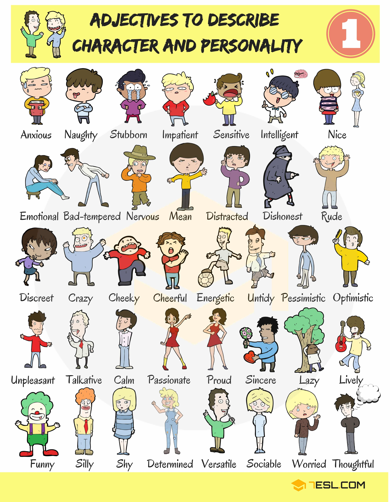
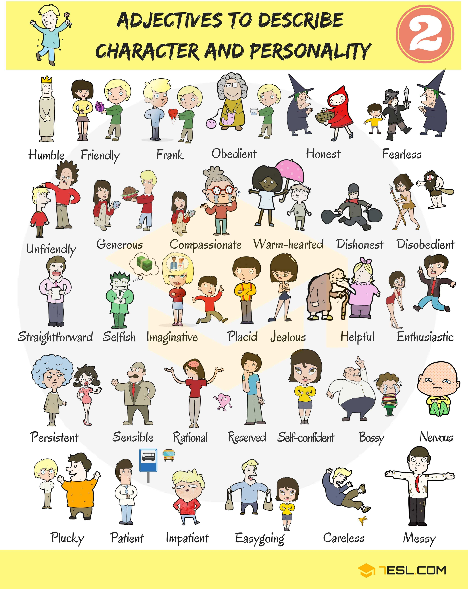
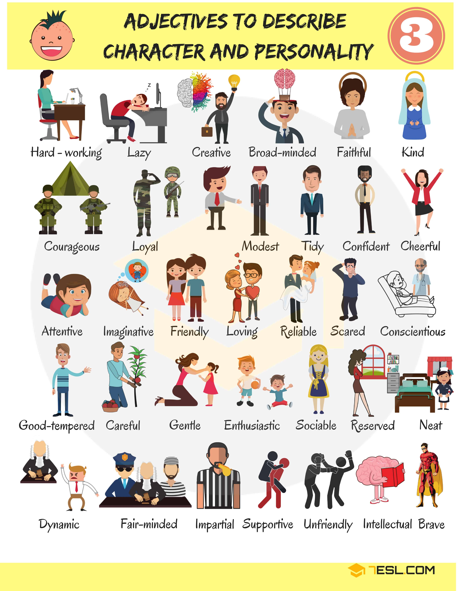
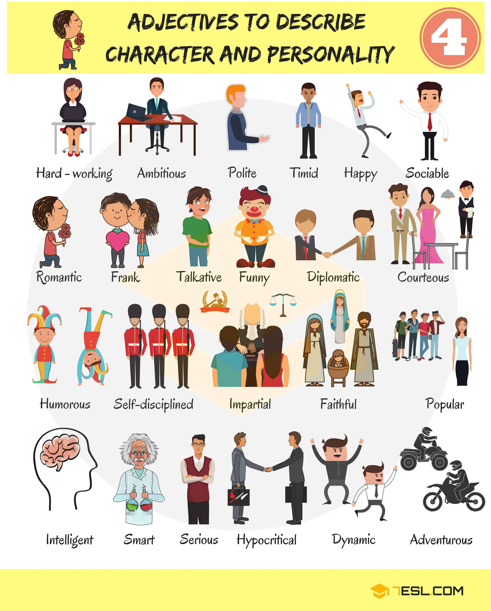
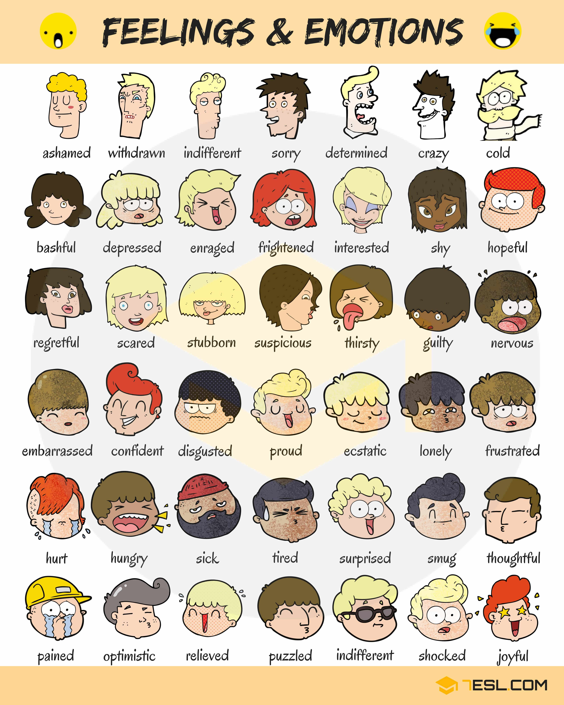
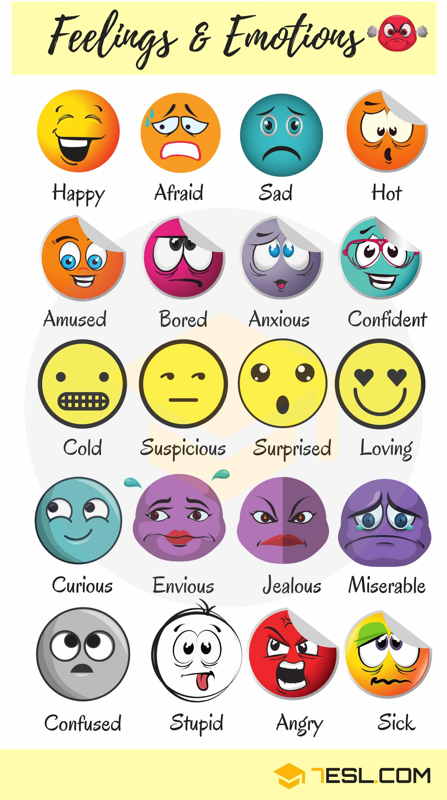
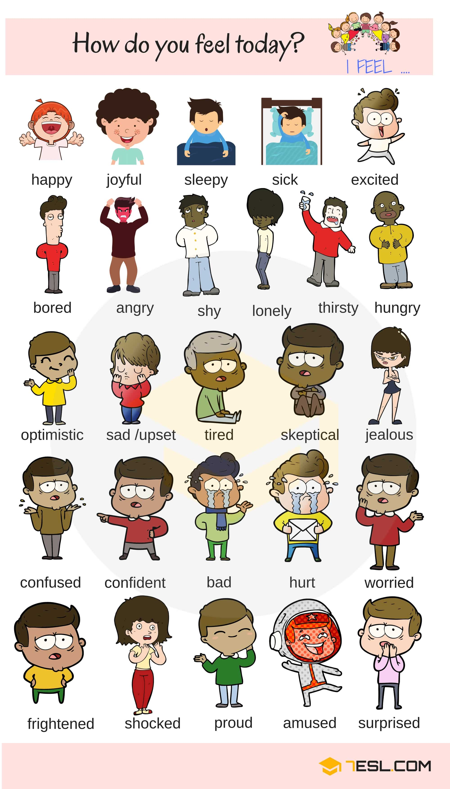
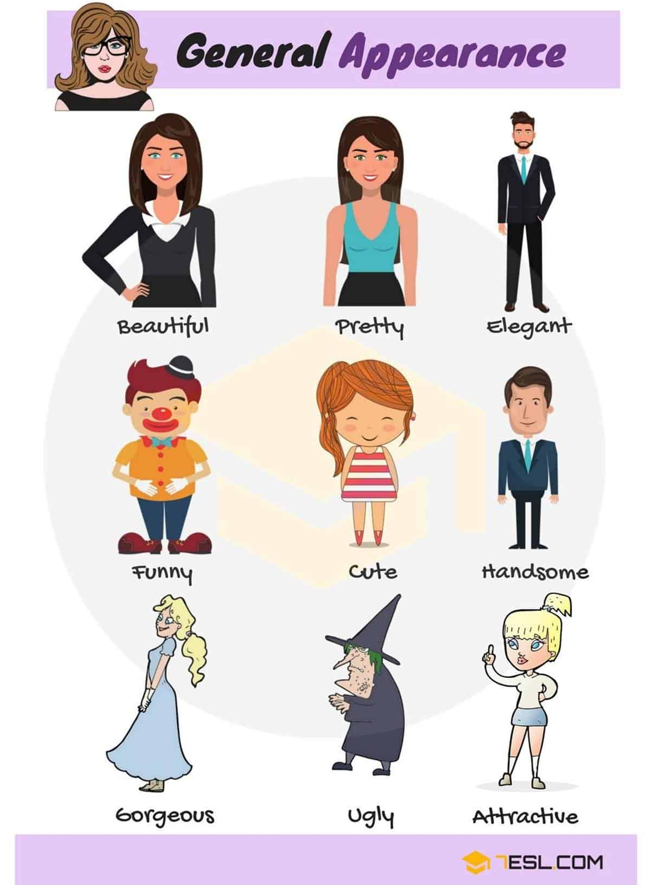
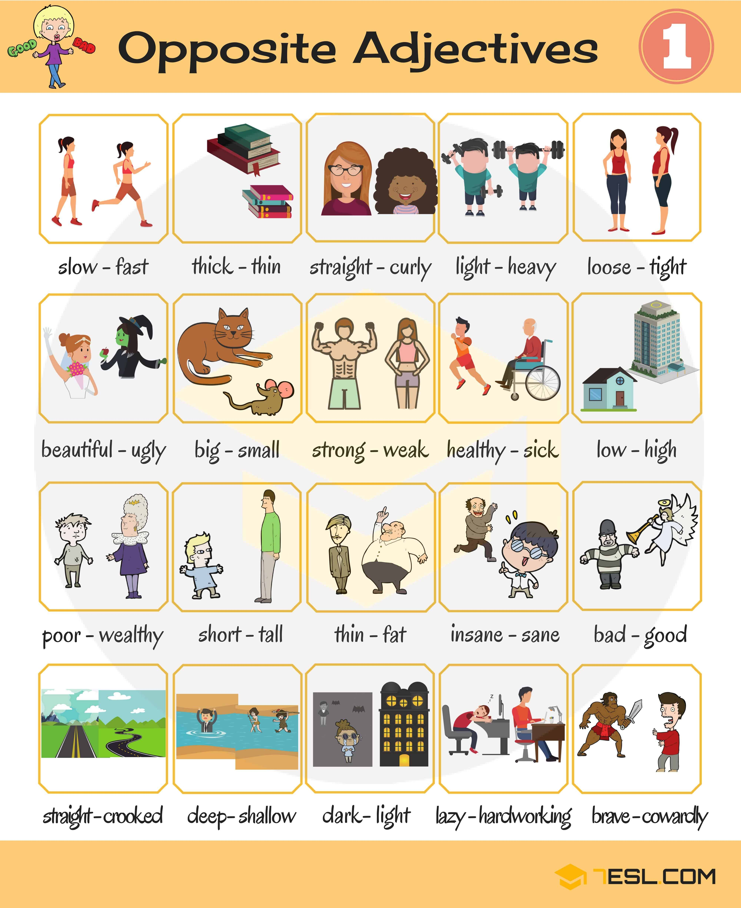
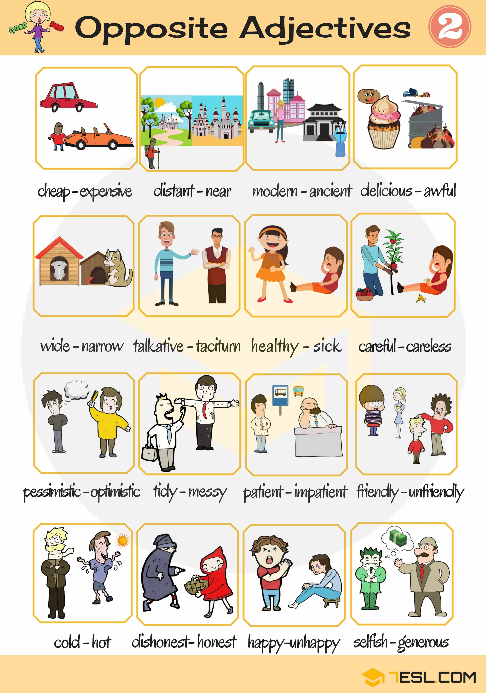

# List of Adjectives (words)

## List of Adjectives that Describe Personality

Word | IPA
------------ | -------------
Anxious
Naughty
Stubborn
Sensitive
Intelligent
Nice
Emotional
Bad-tempered
Nervous
Mean
Distracted
Dishonest
Rude
Discreet
Crazy
Cheeky
Cheerful
Energetic
Untidy
Pessimistic
Optimistic
Unpleasant
Talkative
Calm
Passionate
Proud
Sincere
Lazy
Lively
Funny
Silly
Shy
Determined
Versatile
Sociable
Worried
Thoughtful
Humble
Friendly
Frank
Obedient
Honest
Fearless
Unfriendly
Generous
Compassionate
Warm-hearted
Disobedient
Straightforward
Selfish
Imaginative
Placid
Jealous
Helpful
Enthusiastic
Persistent
Sensible
Rational
Reserved
Self-confident
Bossy
Plucky
Patient
Impatient
Easygoing
Careless
Messy
Hard-working
Creative
Broad-minded
Faithful
Kind
Courageous
Loyal
Modest
Tidy
Confident
Attentive
Loving
Reliable
Scared
Conscientious
Good-tempered
Careful
Gentle
Neat
Dynamic
Fair-minded
Impartial
Supportive
Timid
Intellectual
Brave
Ambitious
Polite
Happy
Romantic
Diplomatic
Courteous
Humorous
Self-disciplined
Popular
Smart
Serious
Hypocritical
Adventurous

## Feelings and Emotions 

Word | IPA
------------ | -------------
Happy
Afraid
Sad
Hot
Amused
Bored
Anxious
Confident
Cold
Suspicious
Surprised
Loving
Curious
Envious
Jealous
Miserable
Confused
Stupid
Angry
Sick
Ashamed
Withdrawn
Indifferent
Sorry
Determined
Crazy
Bashful
Depressed
Enraged
Frightened
Interested
Shy
Hopeful
Regretful
Scared
Stubborn
Thirsty
Guilty
Nervous
Embarrassed
Disgusted
Proud
Ecstatic
Lonely
Frustrated
Hurt
Hungry
Tired
Smug
Thoughtful
Pained
Optimistic
Relieved
Puzzled
Shocked
Joyful
Sleepy
Excited
Skeptical
Bad
Worried

## Physical Appearance Adjectives List

- Describing General Appearance

Word | IPA
------------ | -------------
Beautiful
Pretty
Elegant
Funny
Cute
Handsome
Gorgeous
Ugly
Attractive

- Describing Someone’s Age

Word | IPA
------------ | -------------
Young
Middle-aged
Old

- Describing Someone’s Build

Word | IPA
------------ | -------------
Well-Built
Plump
Thin
Fat
Slim

- Describing Someone’s Height

Word | IPA
------------ | -------------
Short
Medium-height
Tall

- Describing Someone’s Eyes

Word | IPA
------------ | -------------
Blue
Brown
Small
Big round
Oval
Wear glasses

- Describing Someone’s Face

Word | IPA
------------ | -------------
Round
Oval
Square
Long

- Describing Someone’s Nose

Word | IPA
------------ | -------------
Straight
Hooked
Long
Small
Turned-up
Describing Someone’s Mouth
Large
Small

- Describing Someone’s Lips

Word | IPA
------------ | -------------
Full
Curved
Thin

- Describing Someone’s Ears

Word | IPA
------------ | -------------
Large
Small

## Opposite Adjectives List

Word | IPA
------------ | -------------
Slow – Fast
Thick – Thin
Straight – Curly
Light – Heavy
Loose – Tight
Beautiful – Ugly
Big – Small
Strong – Weak
Healthy – Sick
Low – High
Poor – Wealthy
Short – Tall
Thin – Fat
Insane – Sane
Bad – Good
Straight – Crooked
Deep – Shallow
Dark – Light
Lazy – Hard-working
Brave – Cowardly
Cheap – Expensive
Distant – Near
Modern – Ancient
Delicious – Awful
Wide – Narrow
Talkative – Taciturn
Healthy – Sick
Careful – Careless
Pessimistic – Optimistic
Tidy – Messy
Patient – Impatient
Friendly – Unfriendly
Cold – Hot
Dishonest – Honest
Happy – Unhappy
Selfish – Generous

