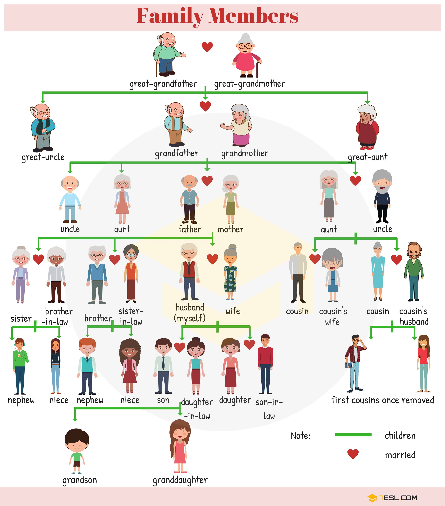
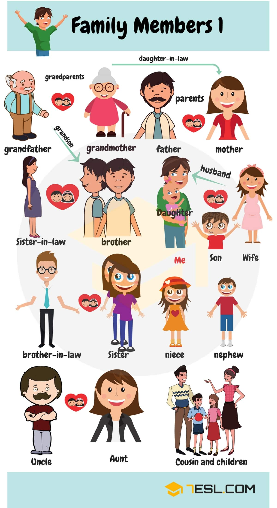
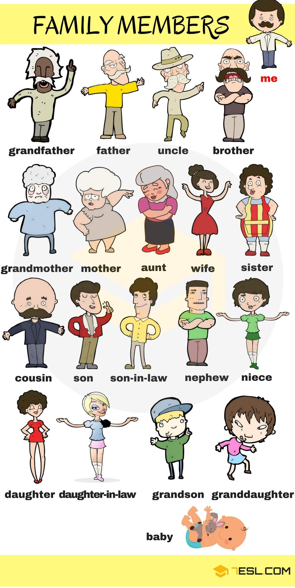
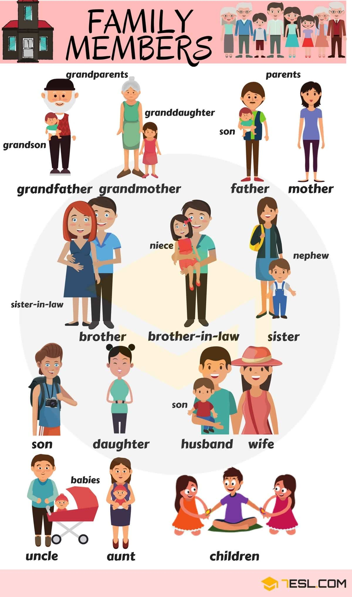
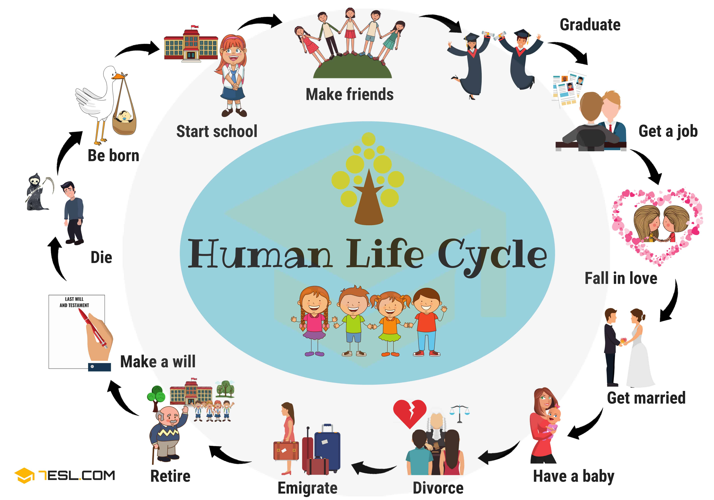

# Family Members: Names of Members of the Family in English

## Family tree

Word | IPA
------------ | -------------
Great-grandfather
Great-grandmother
Great-uncle
Grandfather
Grandmother
Great-aunt
Uncle
Aunt
Father
Mother
Uncle (Husband of Aunt)
Sister
Brother-in-law
Brother
Sister-in-law
Husband
Wife
Cousin
Cousin’s wife
Cousin
Cousin’s husband
Nephew
Niece
Son
Daughter-in-law
Daughter
Son-in-law
First cousin once removed
Grandson
Granddaughter

## Human Life Cycle

Word | IPA
------------ | -------------
Be born
Start school
Make friends
Graduate
Get a job
Fall in love
Get married
Have a baby
Divorce
Emigrate
Retire
Make a will
Die

