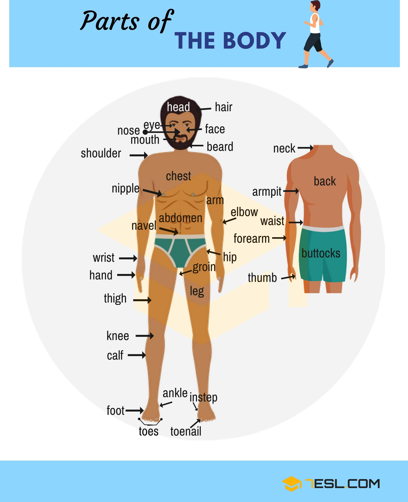
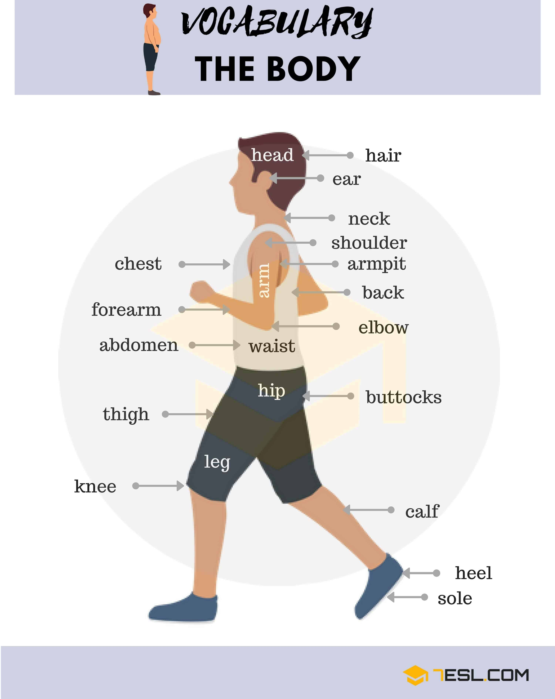

# Body Parts

## Parts Of The Body

Word | IPA
------------ | -------------
Head
Face
Hair
Ear
Neck
Forehead
Beard
Eye
Nose
Mouth
Chin
Shoulder
Elbow
Arm
Chest
Armpit
Forearm
Wrist
Back
Navel
Toes
Ankle
Instep
Toenail
Waist
Abdomen
Buttock
Hip
Leg
Thigh
Knee
Foot
Hand
Thumb

## Parts of the Head

Word | IPA
------------ | -------------
Hair
Temple
Eyelash
Iris
Cheek
Nostril
Lip
Neck
Forehead
Eyebrow
Eye
Eyelid
Ear
Nose
Jaw
Mouth
Chin
Moustache
Beard
Mole

## Parts of the Hand

Word | IPA
------------ | -------------
Thumb
Index finger
Middle finger
Ring finger
Little finger
Palm
Wrist
Knuckle
Fingernail

## Internal Body Parts

Word | IPA
------------ | -------------
Brain
Trachea
Lungs
Heart
Liver
Stomach
Kidneys
Intestines (large intestine and small intestine)
Pharynx
Larynx
Arteries
Gallbladder
Spleen
Urinary bladder
Appendix

## Parts of the Mouth

Word | IPA
------------ | -------------
Canine
Hard palate
Lips
Soft palate
Uvula
Tongue
Gingiva (Gums)
Incisor
Teeth
Mandible
Papillae
Premolar

## Different Types of Hairstyle

Word | IPA
------------ | -------------
Pixie cut
Bob
Medium length
Long
Short blonde
Long blonde
Bun
Ponytail
Pigtail
Curly
Dreadlocks
Mohawk
Red hair
Dyed hair
Gray hair
Long wavy hair
Man bun
Combover
Plaits
Ringlets
Bald

