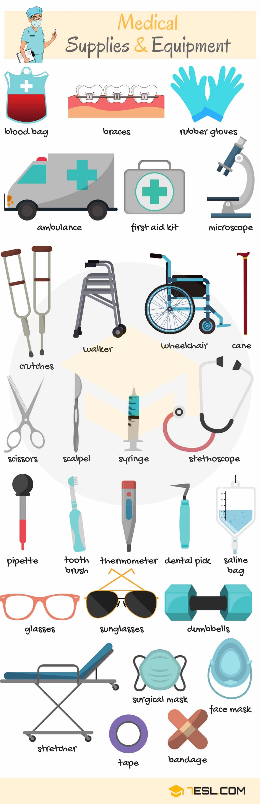

# Health and Healthcare

## Common Diseases

Word | IPA
------------ | -------------
Runny nose
Broken bone
Bruise
Sunburn
Chills
Backache
Nausea
Dizziness
Flu
Stomachache
Fever
Snakebite
Cough

## Diseases and Treatments

- Common Illnesses

Word | IPA
------------ | -------------
Fever
High blood pressure
Broken arm
Injury
Diabetes
Sore finger
Toothache
Stomachache
Sprain

- Common Treatments

Word | IPA
------------ | -------------
Bed rest
Blood tests
Diet
Surgery
Exercise
Physical therapy
Shot (U.S)/ Jab (U.K)
Massage
X-ray
Eye exam
Pressure measuring
Examination
Infusion

## Types of Doctors

Word | IPA
------------ | -------------
Surgeon
Paramedic
Psychologist
Nurse
ENT doctor
Pharmacist
Consulting doctor
Attending doctor
Duty doctor
Family doctor
Veterinarian
Dentist

## Medical Vocabulary

Word | IPA
------------ | -------------
Solution
Oral rinse
Cough syrup
Antiseptic
Lotion
Decongestant spray
Softgel
Blood
Ointment
Lozenges
Powder
Eye drops
Effervescent tablet
Tablet
Toothpaste
Aspirin
Caplet
Capsule

## Medical Supplies and Equipment

Word | IPA
------------ | -------------
Blood bag
Braces
Rubber gloves
Ambulance
First aid kit
Microscope
Crutch
Walker
Wheelchair
Cane
Scissors
Scalpel
Syringe
Stethoscope
Pipette
Tooth brush
Thermometer
Dental pick
Saline bag
Glasses
Sunglasses
Dumbbells
Stretcher
Surgical mask
Face mask
Tape
Bandage

