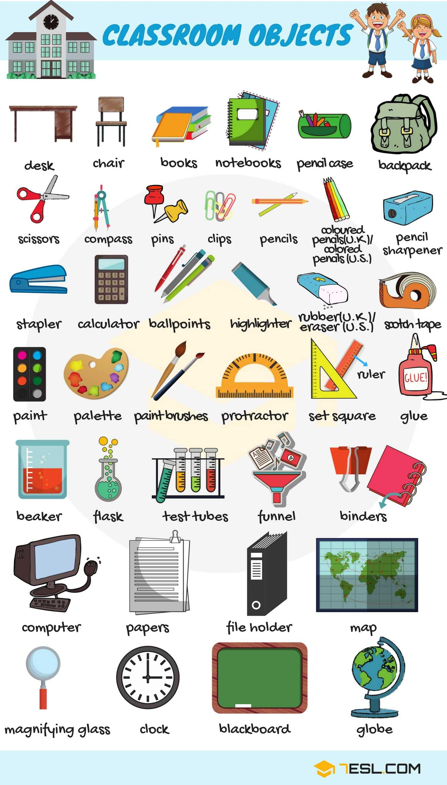
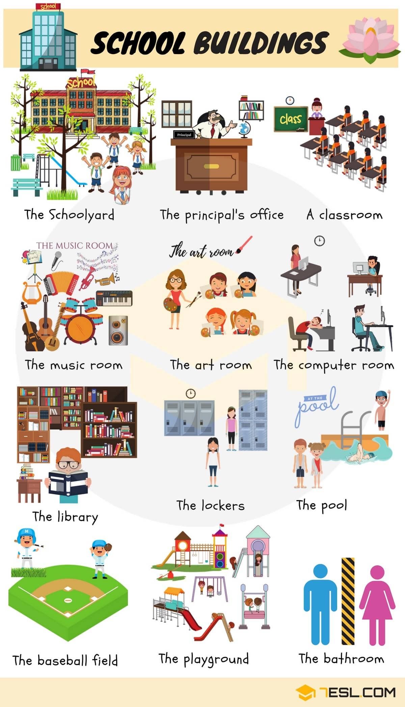
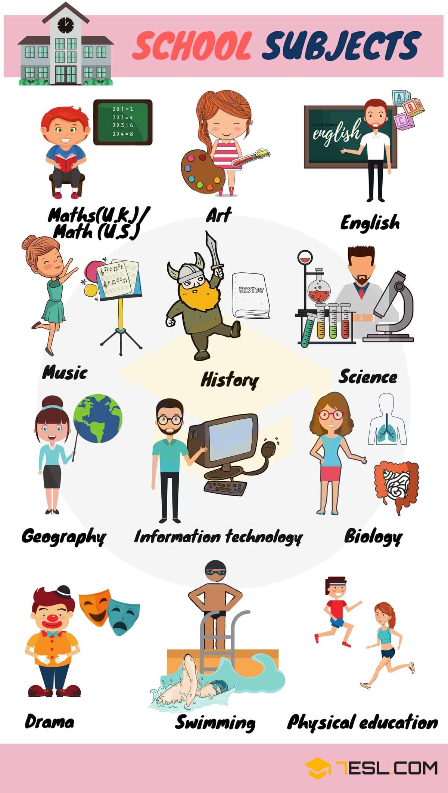

# School Vocabulary

## School Objects

Word | IPA
------------ | -------------
Desk
Chair
Book
Notebook
Pencil case
Backpack
Scissors
Compass
Pins
Clip
Pencil
Coloured pencil (U.K) – Colored pencils (U.S)
Pencil sharpener
Stapler
Calculator
Ballpoint
Highlighter
Rubber(U.K) – eraser (U.S)
Scotch tape
Paint
Palette
Paint brush
Protractor
Set square
Ruler
Glue
Beaker
Flask
Test tube
Funnel
Binder
Computer
Paper
File holder
Map
Magnifying glass
Clock
Blackboard
Globe
Computer
Monitor
Interactive whiteboard
Speakers
Projector
Air conditioner
Remote control
Mouse
Keyboard
Plug
Stereo/ CD player
Electronic dictionary
DVD/ Video player
Fan

## School Rooms and Places

Word | IPA
------------ | -------------
The schoolyard
The Principal’s office
The classroom
The music room
The art room
The computer room
The library
The lockers
The pool
The baseball field
The playground
The toilet

## School Subjects

Word | IPA
------------ | -------------
Maths (U.K) – Math (U.S)
Art
English
Music
History
Science
Geography
Information technology
Biology
Drama
Swimming
Physical education

## People at School

Word | IPA
------------ | -------------
Teacher
Classmate
Coach
Cook
Janitor
Librarian
President
Principal
Professor
Secretary
Students

