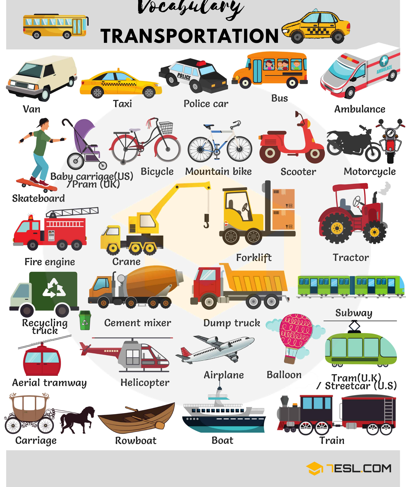
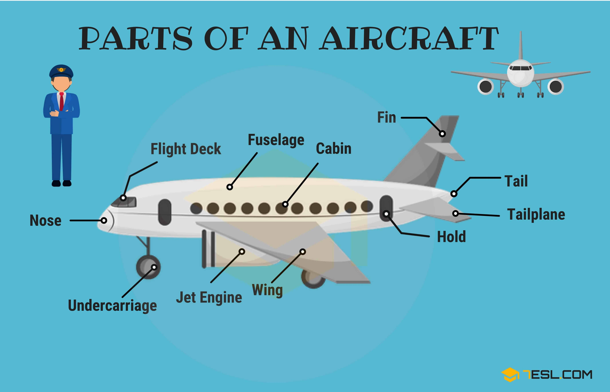

# Transportation and Vehicles

## School Objects

Word | IPA
------------ | -------------
Van
Taxi
Police car
Bus
Ambulance
Skateboard
Baby carriage (US)/ Pram (UK)
Bicycle
Mountain bike
Scooter
Motorcycle
Fire engine
Crane
Forklift
Tractor
Recycling truck
Cement mixer
Dump truck
Subway
Aerial tramway
Helicopter
Airplane
Balloon
Tram (UK)/ Streetcar (US)
Carriage
Rowboat
Boat
Train

## Types of Ships and Boats

Word | IPA
------------ | -------------
Battleship
Destroyer
Ferry
Schooner
Ship
Barge
Boat
Catamaran
Canoe
Yacht
Gondola
Hovercraft
Sailboat
Trawler
Submarine

## Types of Trucks

Word | IPA
------------ | -------------
Pickup
Tractor
Tow truck
Fire engine
Van
Cement mixer
Tanker
Tractor-trailer
Forklift
Car transporter

## Car Parts Vocabulary

Word | IPA
------------ | -------------
Headlight
Mirror
Window
Trunk (US)/ Boot (UK)
Brake light
Tire (US)/ Tyre (UK)
Door
Hubcap
Gas tank (US)/ Petrol tank (UK)
Windshield (US)/ windscreen (UK)
Hood (US)/ Bonnet (UK)
Roof
Turn signal/ Blinker
Bumper
Door handle
Rear-view mirror
Windshield wiper (US)/ Windscreen wiper (UK)
License plate (US)/ Number plate (UK)

## Bicycle Parts Vocabulary

Word | IPA
------------ | -------------
Handlebar
Brake lever
Brake cable
Seat
Rear brake
Crossbar
Frame
Crank
Wheel
Chain
Pedal
Chain wheel
Front brake
Front fork
Hub
Spoke
Rim
Tire

## Motorcycle Parts

Word | IPA
------------ | -------------
Throttle
Brake
Helmet
Pillion (U.K)
Taillight
Seat
Fuel tank
Engine
Turn signal
Headlight
Mudguard
Suspension
Tire
Axle
Muffler
Oil tank
Air filter
Brake pedal

## Aircraft Parts 

Word | IPA
------------ | -------------
Nose
Flight deck
Fuselage
Cabin
Fin
Tail
Tailplane
Hold
Wing
Jet engine
Undercarriage

## Road Signs

Word | IPA
------------ | -------------
Ahead only
Turn left ahead
Turn left
Minimum speed
Maximum speed
Stop and yield
No waiting
No stopping
No entry
Roundabout
No motor vehicles
No cycling
No left turn
No U-turn
No overtaking
No blowing of horn
Two-way traffic ahead
Road narrows on both sides
Hump
Uneven road
Slippery road
Wild animals
Roundabout ahead
Crossroads ahead
Pedestrian crossing ahead
Bend to right
Double bend
Falling rocks
School crossing
Road work
Give way
Traffic signs ahead
Give priority to vehicles from opposite direction
Parking lot
One-way traffic
Dead end street
Priority over oncoming vehicles

