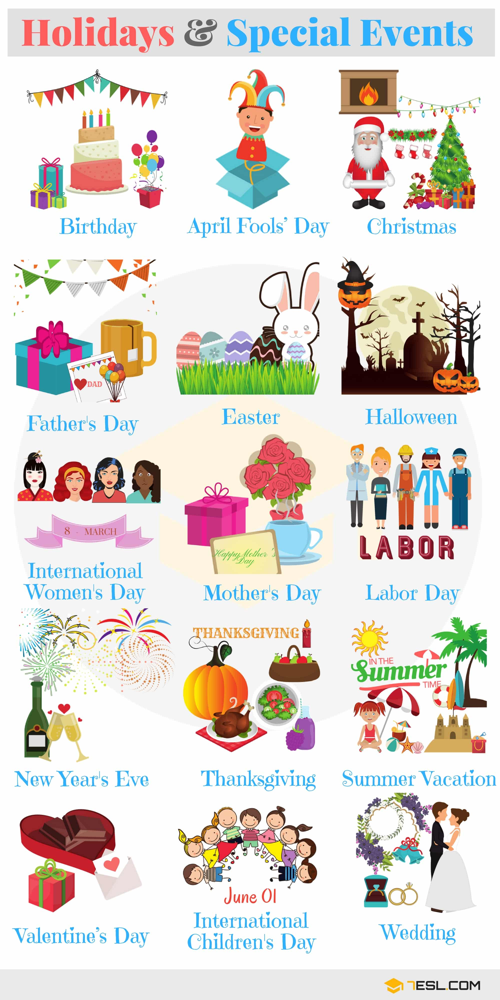
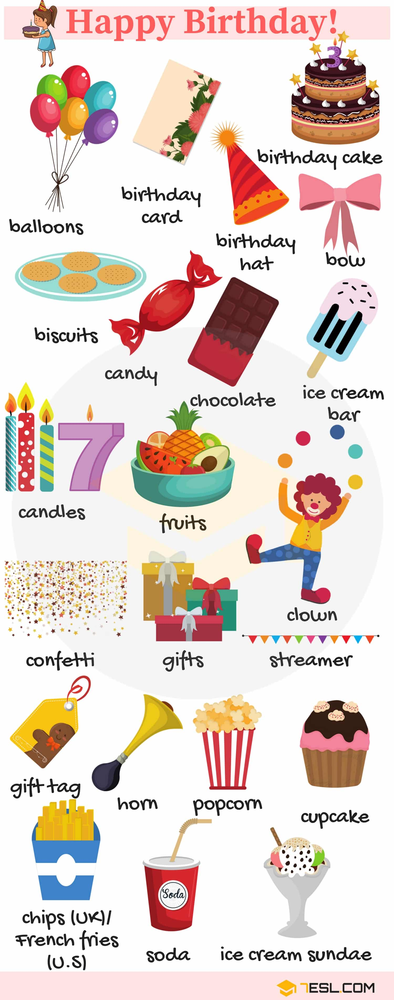
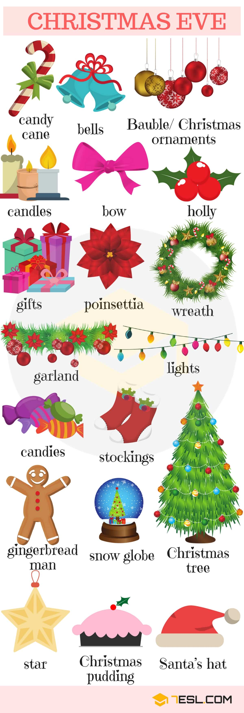
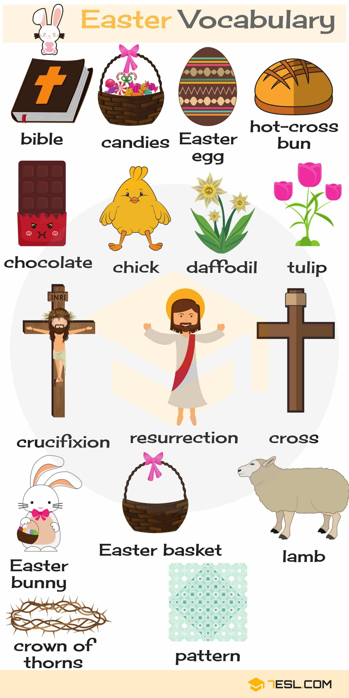
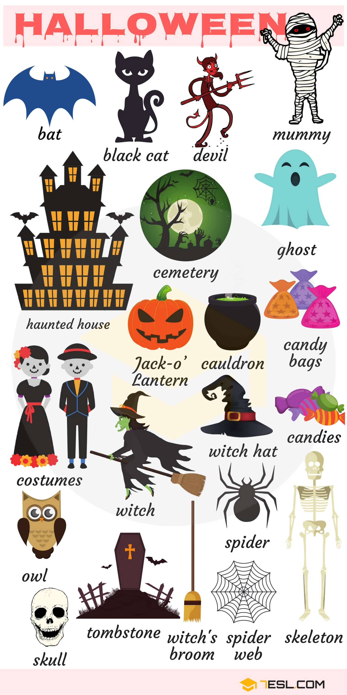
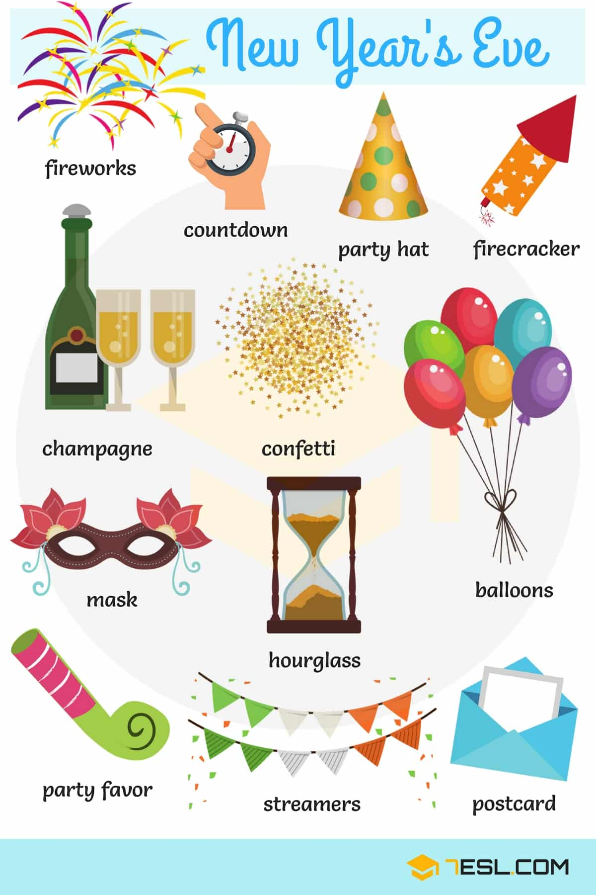
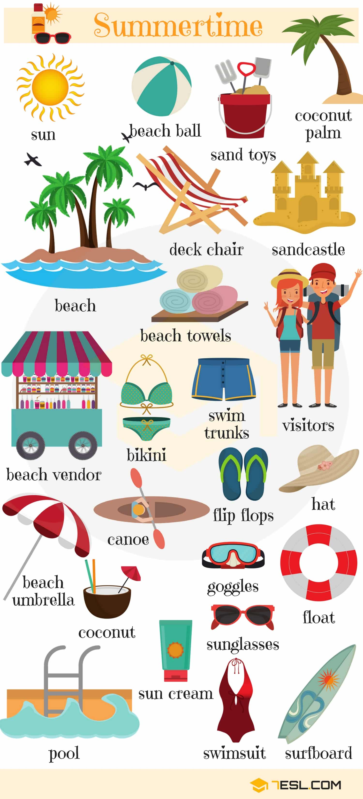
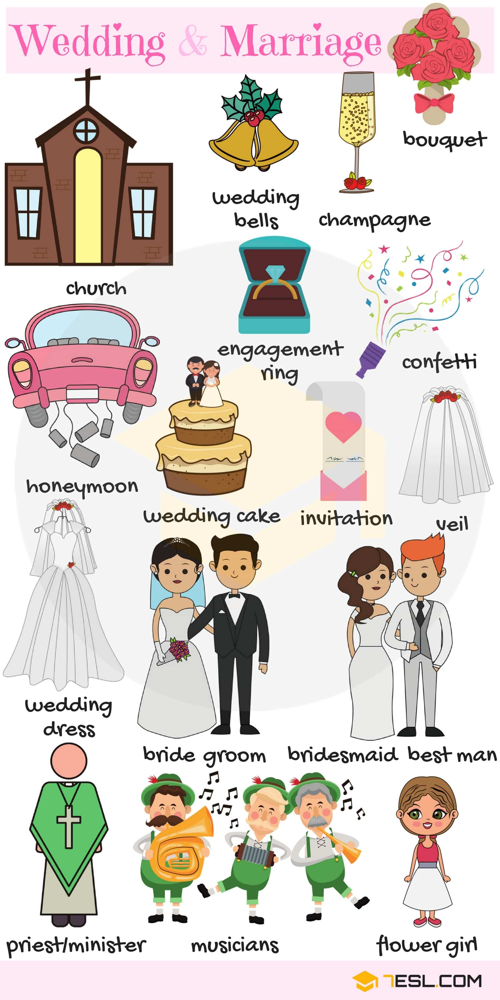
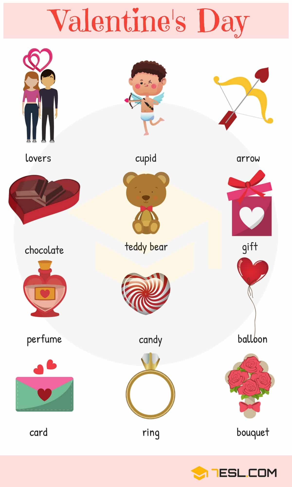

# Holidays and Special Events

## List of Holidays

Word | IPA
------------ | -------------
Birthday – My birthday is on a Sunday this year.
April Fools’Day – April Fools’Day is also one of the year’s shortest holidays.
Christmas – Are you going home for Christmas?
Father’s Day – I will call my dad on Father’s Day.
Easter – They always go to church at Easter.
Halloween – I wore a dress to a Halloween party once.
International Women’s Day – In International Women’s Day, her husband gave her a bunch of beautiful flowers.
Mother’s Day – We sent Mom flowers for Mother’s Day.
Labor Day – Wishing you a very restful and joyous Labor Day.
New Year’s Eve – We’ll have a party on New Year’s Eve.
Thanksgiving – I wish you could be here on Thanksgiving.
Summer vacation – During his summer vacation he visited Russia.
Valentine’s Day – She received a bouquet of red roses on Valentine’s Day.
International Children’s Day – On International Children’s Day, kids are entitled to free entry to all city parks.
Wedding – We haven’t decided on a date for the wedding yet.

## Birthday Vocabulary

Word | IPA
------------ | -------------
Balloon
Birthday card
Birthday hat
Birthday cake
Bow
Biscuit
Candy
Chocolate
Ice cream bar
Candle
Fruit
Confetti
Gift
Streamer
Clown
Gift tag
Horn
Popcorn
Cupcake
Chips (UK)/ French fries (US)
Soda
Ice cream sundae

## Christmas Vocabulary

Word | IPA
------------ | -------------
Candy cane
Bell
Bauble/ Christmas ornament
Candle
Bow
Holly
Gift
Poinsettia
Wreath
Garland
Light
Candy
Stockings
Gingerbread man
Snow globe
Christmas tree
Christmas pudding
Santa’s hat
Fireplace
Gingerbread house
Santa Claus
Elf
Snowman
Sleigh
Reindeer
Santa’s sack
Christmas card
Chimney
Menorah (Hanukkah)
Snowflake

## Easter Vocabulary

Word | IPA
------------ | -------------
Bible
Candy
Easter egg
Hot-cross bun
Chocolate
Chick
Daffodil
Tulip
Crucifixion
Resurrection
Cross
Easter bunny
Easter basket
Lamb
Crown of thorns
Pattern

## Halloween Vocabulary

Word | IPA
------------ | -------------
Bat
Black cat
Devil
Mummy
Haunted house
Cemetery
Ghost
Jack-o’Lantern
Cauldron
Candy bag
Costume
Witch
Witch hat
Candy
Owl
Skull
Tombstone
Witch’s broom
Spider web
Skeleton
Spider

## New Year’s Eve Vocabulary

Word | IPA
------------ | -------------
Fireworks
Countdown
Party hat
Firecracker
Champagne
Confetti
Mask
Hourglass
Balloon
Party favor
Streamer
Postcard

## Summer Vocabulary

Word | IPA
------------ | -------------
Sun
Beach ball
Sand toy
Coconut palm
Beach
Deck chair
Sandcastle
Beach towel
Beach vendor
Bikini
Swim trunks
Visitor
Beach umbrella
Coconut
Goggles
Flip flops
Hat
Float
Sunglasses
Sun cream
Pool
Swimsuit
Surfboard
Canoe

## Wedding and Marriage Vocabulary

Word | IPA
------------ | -------------
Church
Wedding bell
Champagne
Bouquet
Honeymoon
Wedding cake
Engagement ring
Confetti
Invitation
Veil
Wedding dress
Bride
Groom
Bridesmaid
Best man
Priest/ Minister
Musician
Flower girl

## Valentine’s Day

Word | IPA
------------ | -------------
Lover
Cupid
Arrow
Chocolate
Teddy bear
Gift
Perfume
Candy
Balloon
Card
Ring
Bouquet

