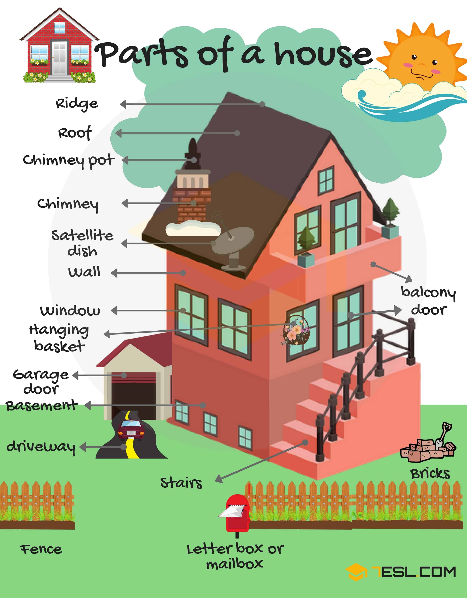
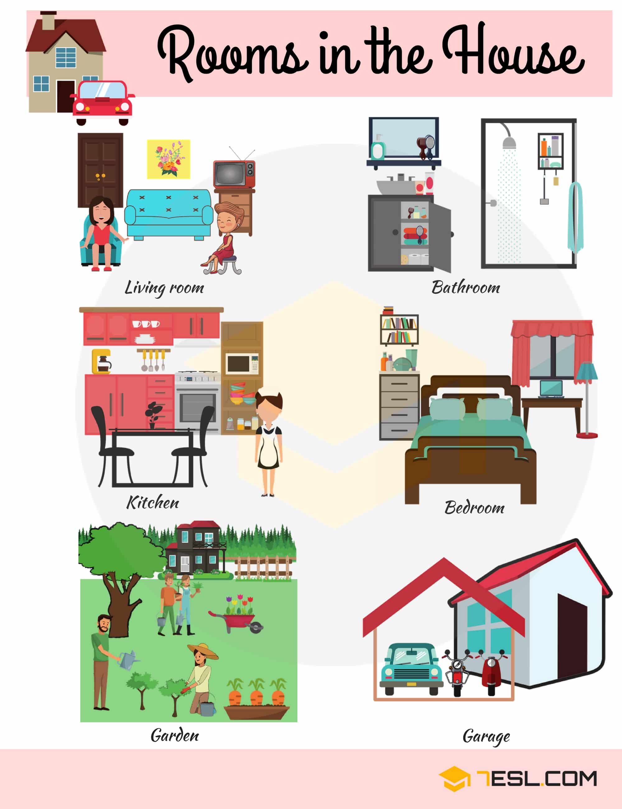
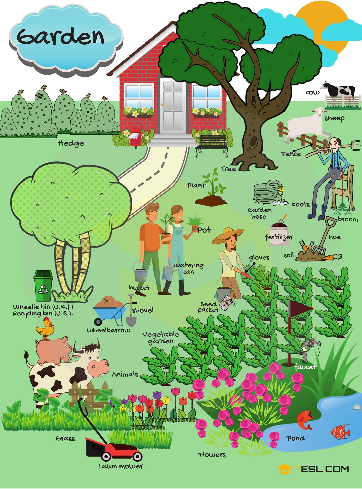
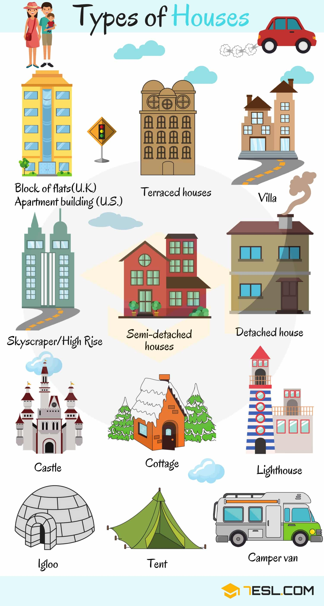

# House Vocabulary: Things Around the House with Pictures

## Parts of a House Vocabulary

Word | IPA
------------ | -------------
Ridge
Roof
Chimney pot
Chimney
Satellite dish
Wall
Window
Hanging basket
Garage door
Basement
Driveway
Fence
Balcony
Door
Brick
Letter box/ Mailbox
Antenna
Door knocker
Garage
Gable
Shutter
Skylight
Step
Burglar alarm
Doorstep
Dormer window
Eaves
Stairs

## Rooms in the House Vocabulary

Word | IPA
------------ | -------------
Living room – the main room in a house where people relax, watch television, …
Bathroom – a room where there is a bath or shower, a basin, and sometimes a toilet
Kitchen – the room where you prepare and cook food
Bedroom – a room for sleeping in
Garden – the area of land next to a house, where there are flowers, grass, and other plants, and often a place for people to sit
Garage – a building for keeping a car in, usually next to or attached to a house

## In the Garden Vocabulary

Word | IPA
------------ | -------------
Hedge
Tree
Cow
Sheep
Fence
Plant
Wheelie bin (U.K)/ Recycling bin (U.S.)
Pot
Bucket
Watering can
Garden hose
Boots
Broom
Fertilizer
Soil
Hoe
Gloves
Shovel
Wheelbarrow
Vegetable garden
Seed packet
Animal
Grass
Lawn mower
Flower
Pond
Faucet

## Types of Houses

Word | IPA
------------ | -------------
House
Hut
Hotel
Building
Farmhouse
Barn
Dormitory
Log cabin
Lighthouse
Nursing home
Castle
Block of Flats (U.K) – Apartment building (U.S)
Terraced houses
Villa
Skyscraper/ high rise
Semi-detached houses
Detached house
Cottage
Igloo
Tent
Camper van

