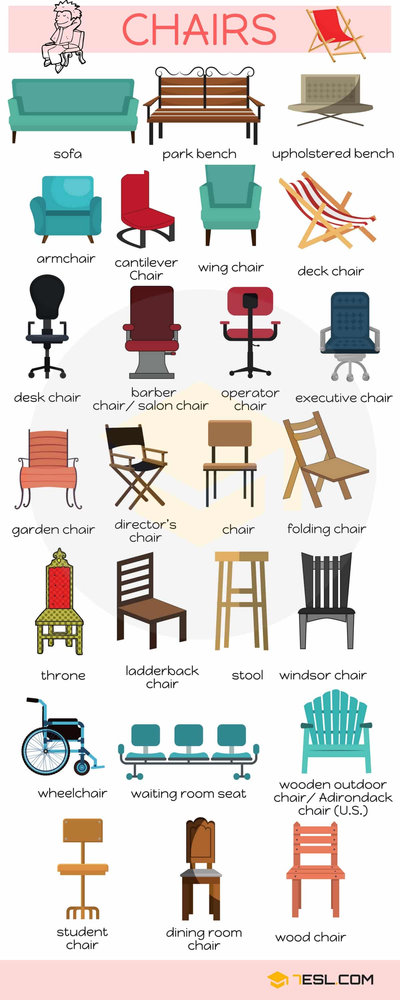
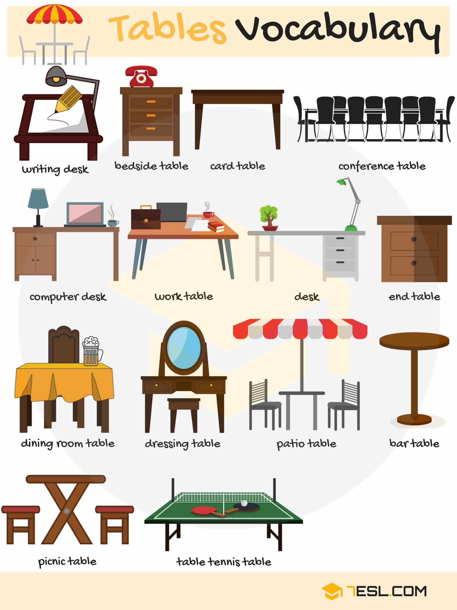

# Types of Furniture

## Baby Furniture Names

Word | IPA
------------ | -------------
Baby lotion
Baby bottle
Bassinet
Bib
Doll
Rattle
Diaper
Pacifier (U.S)/ Dummy (U.K)
Mobile
Puzzle
Doll’s house
Cot (U.K)/ Crib (U.S)
Toy chest
Safety pin
Stroller (U.S)/ Pram (U.K)
Teddy bear
Block

## Chairs Furniture Names

Word | IPA
------------ | -------------
Sofa
Park bench
Upholstered bench
Armchair
Cantilever chair
Wing chair
Deck chair
Desk chair
Barber chair/ Salon chair
Operator chair
Executive chair
Garden chair
Director’s chair
Chair
Folding chair
Throne
Ladderback chair
Stool
Windsor chair
Wheelchair
Waiting room seat
Wooden outdoor chair/ Adirondack chair (U.S.)
Student chair
Dining room chair
Wood chair

## Bedroom Furniture

Word | IPA
------------ | -------------
Air-conditioner
Clothes valet
Bed
Anglepoise lamp/ Balanced-arm lamp
Cot (U.K)/ Crib (U.S)
Upholstered bench
Bedside table
Bookshelf
Bureau (U.K)/ Desk (U.S)
Chest of drawers (U.K)/ Dresser (U.S)
Clock
Fan
Pillow
Hat stand
Dressing table
Table lamp
Mirror
Curtains
Ironing board
Television
Telephone
Hope chest
Picture
Nightstand

## Living Room Furniture

Word | IPA
------------ | -------------
Wing chair
TV stand
Sofa
Cushion
Telephone
Television
Speaker
End table
Tea set
Fireplace
Remote
Fan
Floor lamp
Carpet
Table
Blinds
Curtains
Picture
Vase
Grandfather clock

## Tables Furniture Names

Word | IPA
------------ | -------------
Writing desk
Bedside table
Card table
Conference table
Computer desk
Work table
Desk
End table
Dining room table
Dressing table
Patio table
Bar table
Picnic table
Table tennis table