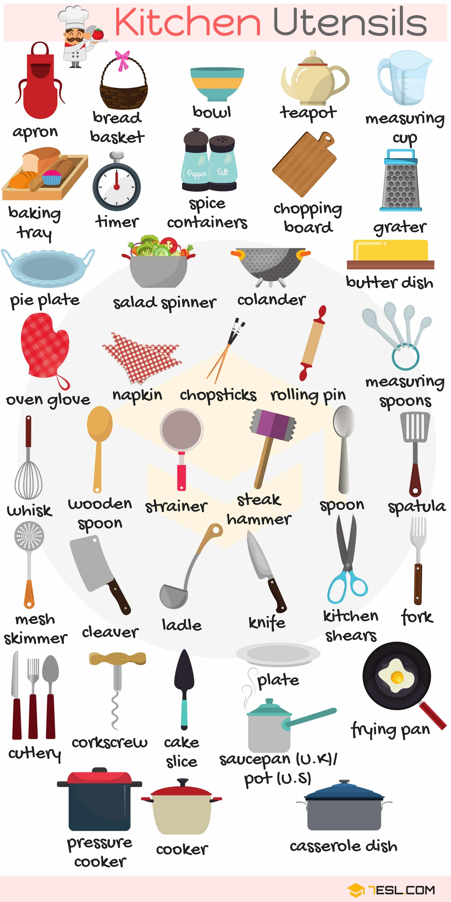

# Kitchenware

## List of Kitchen Appliances & Gadgets

Word | IPA
------------ | -------------
Tea maker
Toaster
Kettle
Mixer
Refrigerator
Blender
Cabinet
Cupboard
Cooker hood (U.K) – range hood (U.S)
Microwave
Dish soap
Kitchen counter
Dinner table
Kitchen scale
Pedal bin
Grill
Drawer

## Kitchen Utensils

Word | IPA
------------ | -------------
Apron
Bread basket
Bowl
Teapot
Measuring cup
Baking tray
Timer
Spice container
Chopping board
Grater
Pie plate
Salad spinner
Colander
Butter dish
Oven glove
Napkin
Chopsticks
Rolling pin
Measuring spoon
Whisk
Wooden spoon
Strainer
Steak hammer
Spoon
Spatula
Mesh skimmer
Cleaver
Ladle
Knife
Kitchen shears
Fork
Cutlery
Corkscrew
Cake slice
Saucepan (U.K) – pot (U.S)
Frying pan
Pressure cooker
Cooker
Casserole dish

## Cups and Glasses

Word | IPA
------------ | -------------
Wine glass
Water goblet
Margarita glass
Hurricane glass
Champagne flute
Cocktail glass
Irish coffee glass
Cognac balloon
Plastic cup
Mug
Beer mug
Weizen glass
Teacup
Demitasse
Footed pilsner glass
Collins glass
Vodka glass
Shot glass

## Formal Table Setting

Word | IPA
------------ | -------------
Dessert fork
Tea spoon
White wine glass
Red wine glass
Water goblet
Bread and butter knife
Coffee cup
Saucer
Bread and butter plate
Napkin
Salad fork
Dinner fork
Dinner plate
Dinner knife
Salad knife

