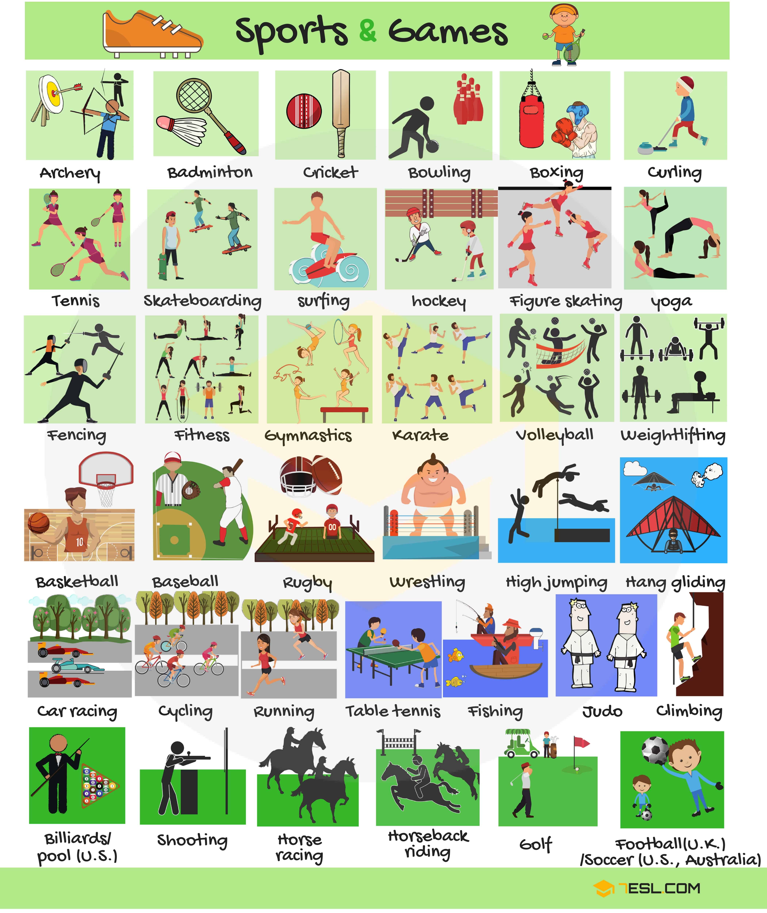
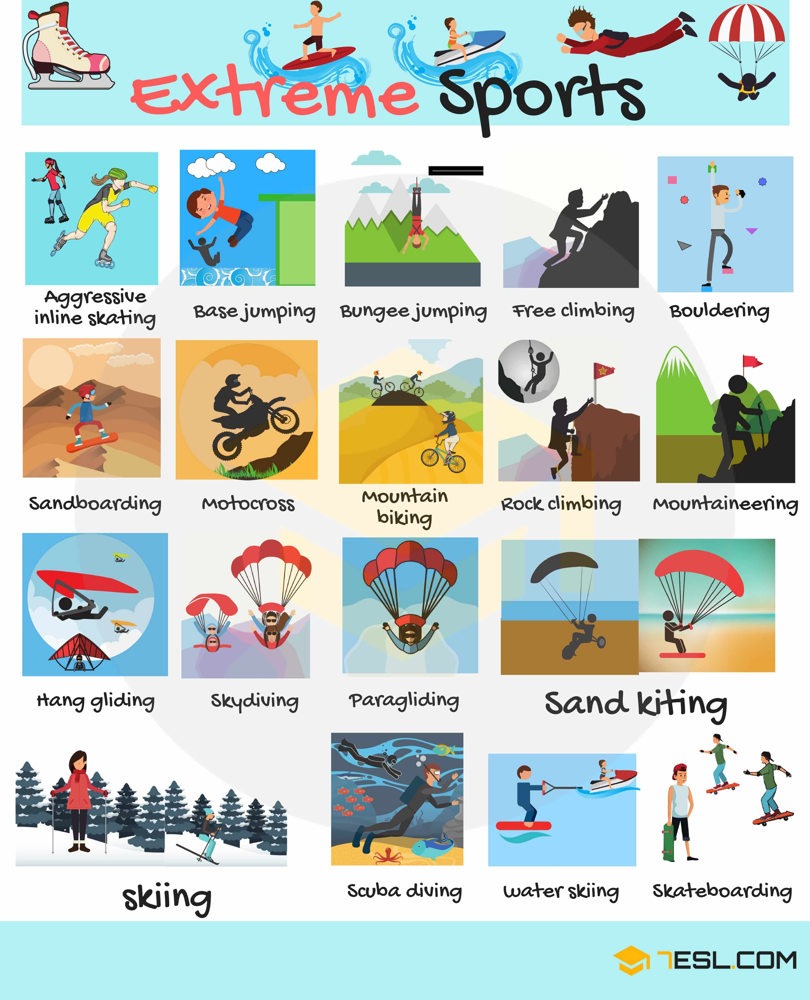
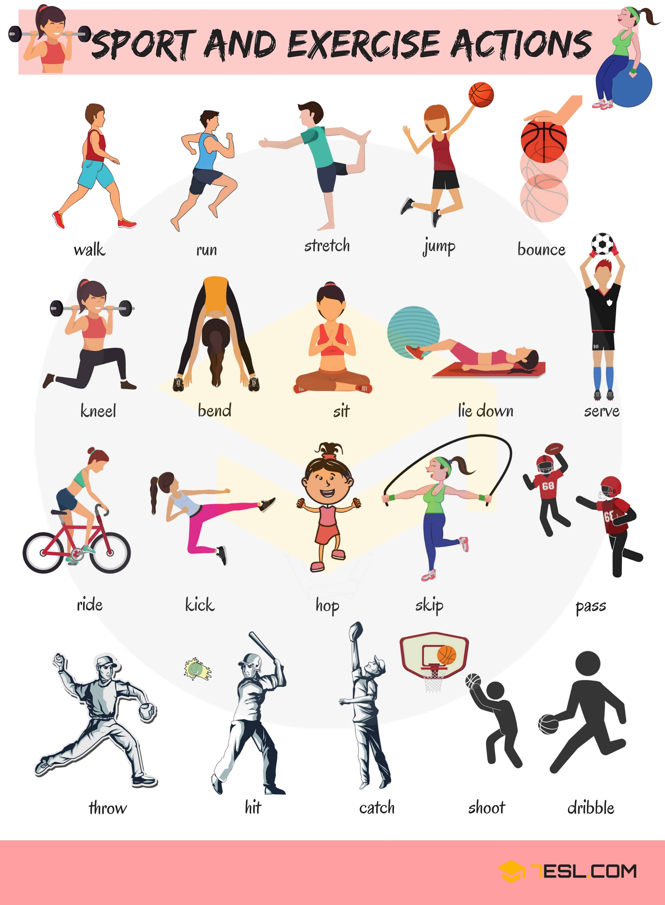

# Types of Sports

## Games and Sports Vocabulary

Word | IPA
------------ | -------------
Archery
Badminton
Cricket
Bowling
Boxing
Curling
Tennis
Skateboarding
Surfing
Hockey
Figure skating
Yoga
Fencing
Fitness
Gymnastics
Karate
Volleyball
Weightlifting
Basketball
Baseball
Rugby
Wrestling
High jumping
Hang gliding
Car racing
Cycling
Running
Table tennis
Fishing
Judo
Climbing
Billiards/ Pool (U.S.)
Shooting
Horse racing
Horseback riding
Golf
Football (U.K)/ Soccer (U.S., Australia)

## Extreme Sports Vocabulary

Word | IPA
------------ | -------------
Aggressive inline skating
Base jumping
Bungee jumping
Free climbing
Bouldering
Sandboarding
Motocross
Mountain biking
Rock climbing
Mountaineering
Hang gliding
Skydiving
Paragliding
Sand kiting
Skiing
Scuba diving
Water skiing
Skateboarding

## Action Words for Different Types of Sports

Word | IPA
------------ | -------------
Walk
Run
Stretch
Jump
Bounce
Serve
Lie down
Sit
Bend
Kneel
Ride
Kick
Hop
Skip
Pass
Dribble
Shoot
Catch
Hit
Throw

