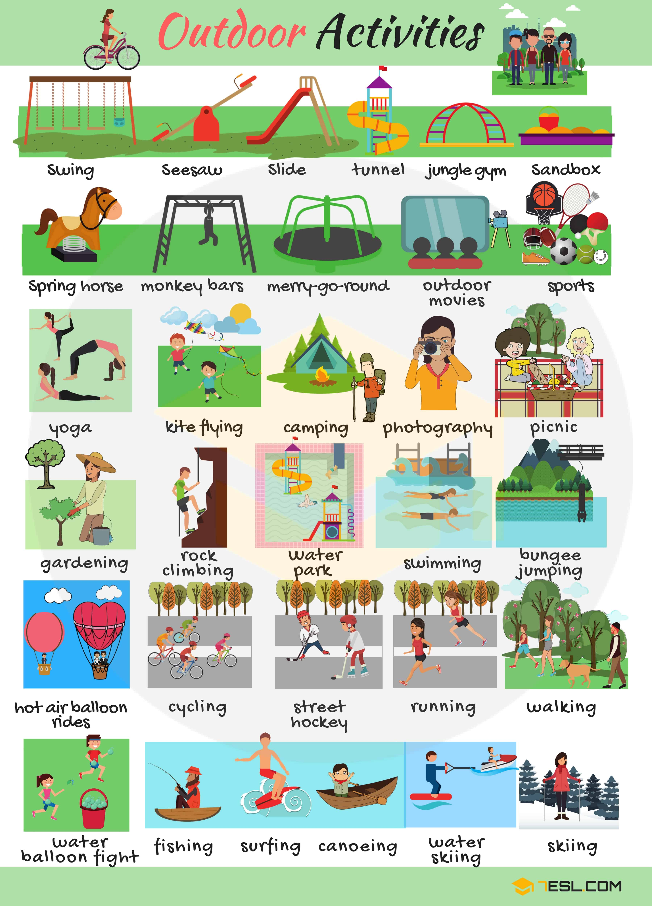
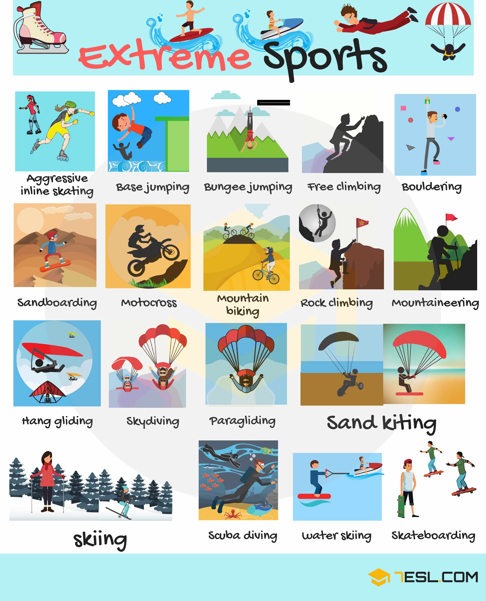
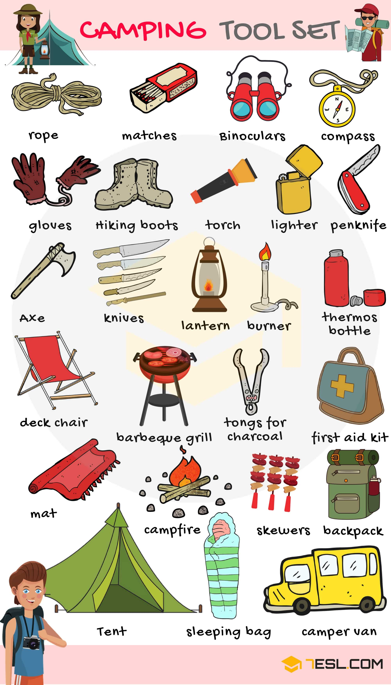
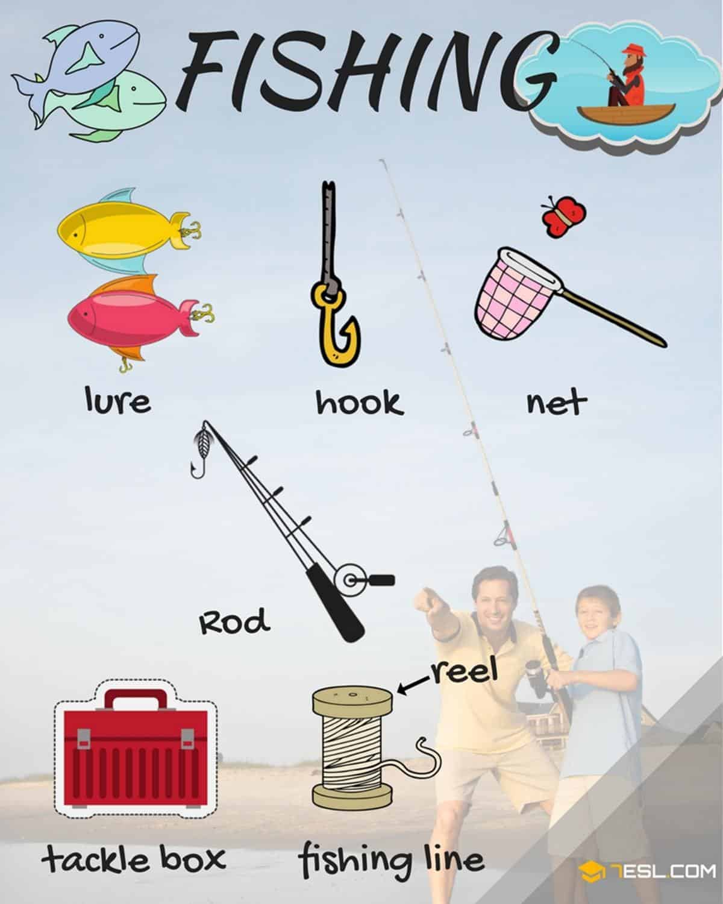

# Outdoor Games

## List of Common Outdoor Games

Word | IPA
------------ | -------------
Bungee jumping
Camping
Canoeing
Cycling
Fishing
Gardening
Hot air balloon rides
Jungle gym
Kite flying
Merry-go-round
Monkey bars
Outdoor movies
Picnic
Photography
Rock climbing
Running
Sandbox
Seesaw
Skiing
Slide
Sports
Spring horse
Street hockey
Surfing
Swimming
Swing
Tunnel
Walking
Water balloon fight
Water park
Water skiing
Yoga

## Extreme Games

Word | IPA
------------ | -------------
Aggressive inline skating
Base jumping
Bouldering
Bungee jumping
Free climbing
Hang gliding
Motocross
Mountain biking
Mountaineering
Paragliding
Rock climbing
Sand kiting
Sandboarding
Scuba diving
Skateboarding
Skiing
Skydiving
Water skiing

## Extreme Games

Word | IPA
------------ | -------------
Rope
Match
Binoculars
Compass
Gloves
Hiking boots
Torch
Lighter
Penknife
Axe
Knives
Lantern
Burner
Thermos bottle
Deck chair
Barbeque grill
Tongs for charcoal
First aid kit
Mat
Campfire
Skewer
Backpack
Tent
Sleeping bag
Camper van

## Fishing Activities

Word | IPA
------------ | -------------
Lure
Hook
Net
Rod
Tackle box
Fishing line