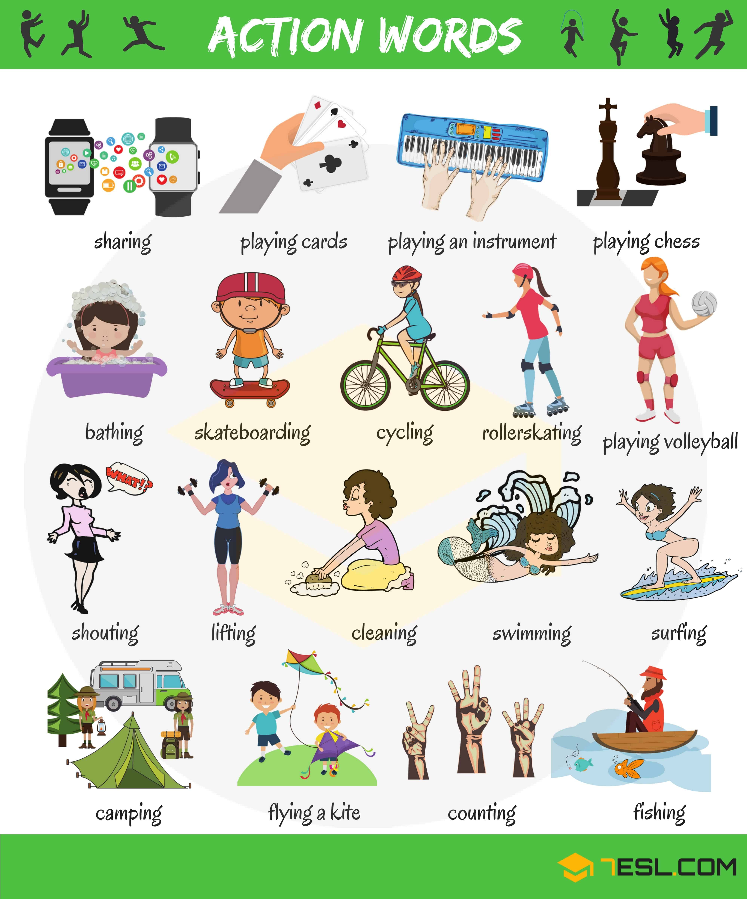
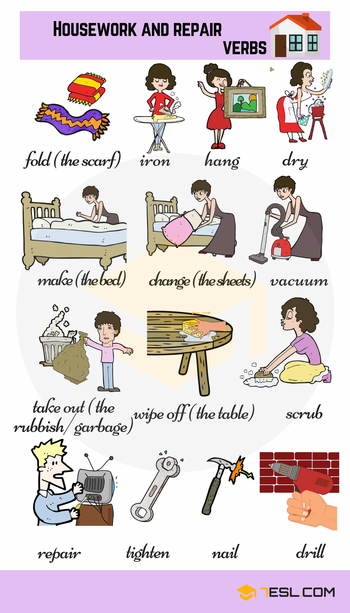

# Common Verbs 

## Action Verbs for Kids

Word | IPA
------------ | -------------
Ride
Sit down
Stand up
Fight
Laugh
Read
Play
Listen
Cry
Think
Sing
Watch TV
Dance
Turn on
Turn off
Win
Fly
Cut
Throw away
Sleep
Close
Open
Write
Give
Jump
Eat
Drink
Cook
Wash
Wait
Climb
Talk
Crawl
Dream
Dig
Clap
Knit
Sew
Smell
Kiss
Hug
Snore
Bathe
Bow
Paint
Dive
Ski
Stack
Buy
Shake

## Verbs of Body Movement

Word | IPA
------------ | -------------
Bend
Lift
Carry
Kneel
Hold
Sit
Drag
Jump
Leap
Pick up
Punch
Pull
Dive
Push
Run
Lean
Squat
Throw
Tiptoe
Walk
Hit
Catch
Kick
Kiss
Clap
Laugh
Dance
Break
Stand
Jog
March
Wave
Talk
Open
Cartwheel
Put down
Stretch
Drop
Point
Slip
Trip
Look
Cry
Lie down
Pour
Crawl

## Cooking Verbs for Kids

Word | IPA
------------ | -------------
Break
Melt
Spread
Layer
Roll out
Fry
Peel
Mix
Whip
Saute
Taste
Cut
Chop
Slice
Grate
Boil
Steam
Pinch
Pour
Add
Barbecue
Roast
Bake
Stir
Weigh

## Daily Routines and Activities

Word | IPA
------------ | -------------
Do the laundry
Hang the clothes
Iron the clothes
Make the bed
Go to bed
Wake up
Brush the teeth
Drive to work
Get home
Take a bath
Brush your hair
Surf the net
Play with friends
Go to school
Go shopping
Exercise
Wash the car
Get dressed
Go out with a friend
Take pictures
Play the guitar
Water the plant
Go for a walk
Work
Have breakfast
Have lunch
Have dinner
Make dinner
Fold the laundry
Surf the net
Feed the dog
Take a taxi
Wait for the bus
Paint the picture
Have a break (U.K) – Take a break (U.S)
Walk the dog
Take out the rubbish (U.S)
Sweep the floor
Rake the leaves
Read the news
Clean the window
Cut the grass
Do the dishes
Paint the house

## Classroom Verbs for Kids

Word | IPA
------------ | -------------
Teach
Think
Spell
Give
Study
Read
Cut
Experiment
Observe
Listen
Play
Sing
Say
Draw
Count
Calculate
Open
Close
Paint
Show
Explain
Ask

## Housework and Repair Verbs

Word | IPA
------------ | -------------
Fold
Iron
Hang
Dry
Make (the bed)
Change (the sheets)
Vacuum
Take out (the rubbish/ garbage)
Wipe off (the table)
Scrub
Repair
Tighten
Nail
Drill

## Restaurant Verbs for Kids

Word | IPA
------------ | -------------
Give – The waiter gives me the menu.
Drink – Can I have something to drink?
Serve – They serve good nosh in the cafeteria.
Pay – Can I pay by installment payment?
Eat – You can’t eat your cake and have it.
Cook – The pizza will then take about twenty minutes to cook.
Hold – Hold the knife at an angle.
Light – Better to light one candle than to curse the darkness.
Order – What do you suggest I order?
Spread – He spread some strawberry jam on his toast.
Lift – He couldn’t lift the table and no more could I.
Write – Write it down on a piece of paper.
Slice – It’s best to slice into a rich cake from the middle.
Stack – They are specially packaged so that they stack easily.
Set (the table) – He is setting the table…

## Sport and Exercise Actions

Word | IPA
------------ | -------------
Walk – Don’t try to walk before you can crawl.
Run – Do not run too fast after gain.
Stretch – Breathe in through your nose as you stretch up.
Jump – Can you jump over the river?
Bounce – Bounce the ball and try and hit it over the net.
Serve – Serving is arguably the most important aspect of the game, as it is the one shot which has to be in every single rally.
Lie down – For this exercise, it is best to lie down, or sit with both feet on the floor.
Sit – Sit on the floor, stretching your legs out in front of you.
Bend – Lie flat and let your knees bend.
Kneel – Do not run, stand, kneel or spin in the slide.
Ride – Life is a horse, and either you ride it or it rides you.
Kick – The kids love to kick a ball against my wall.
Hop – I tried to hop on my good foot while holding onto Jim…