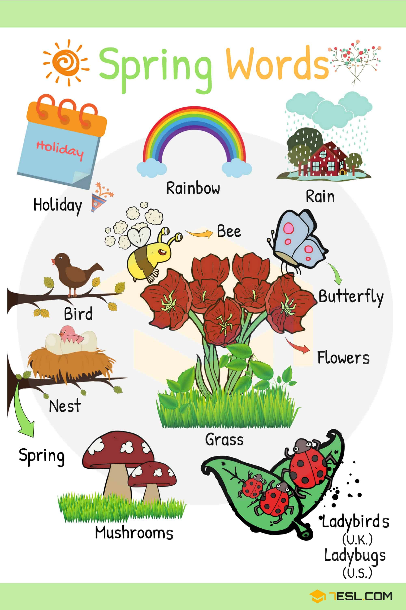
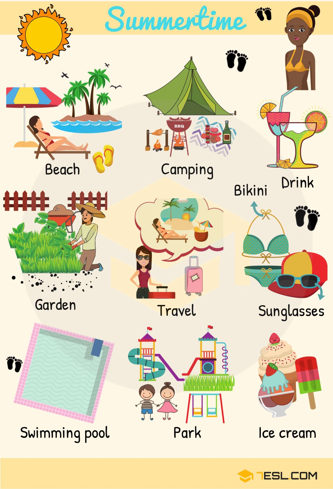
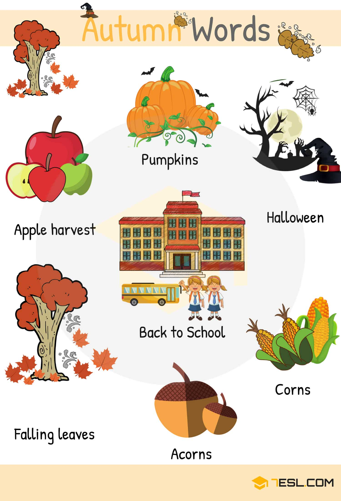
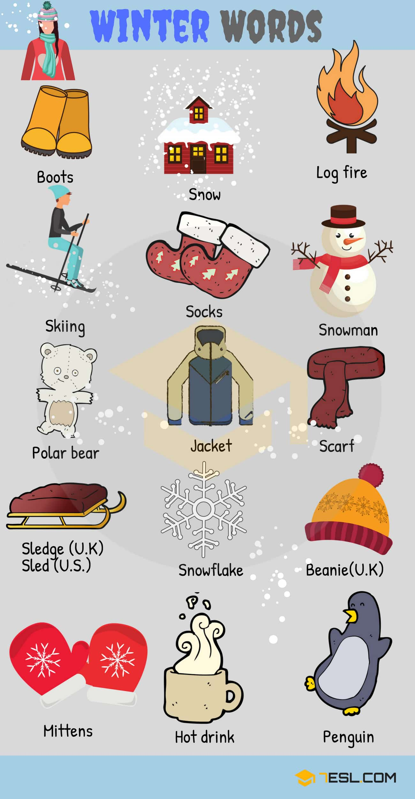
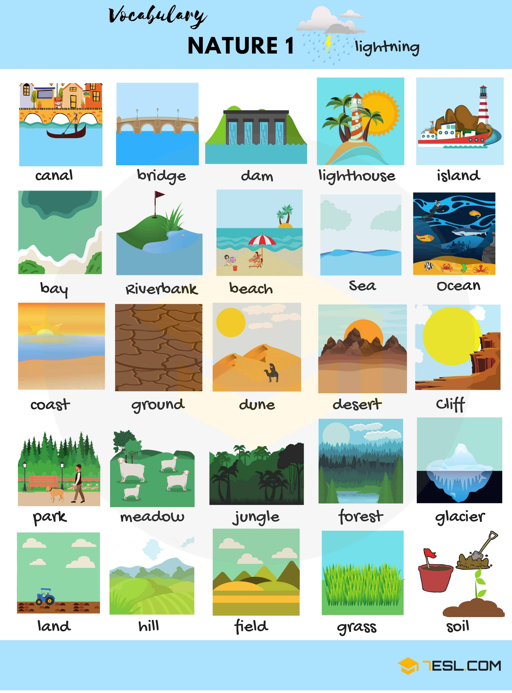
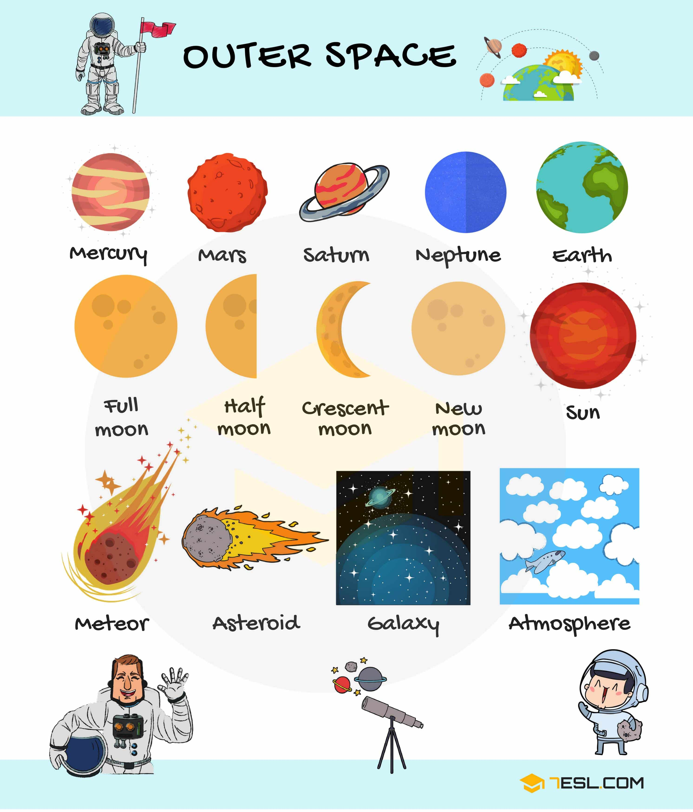
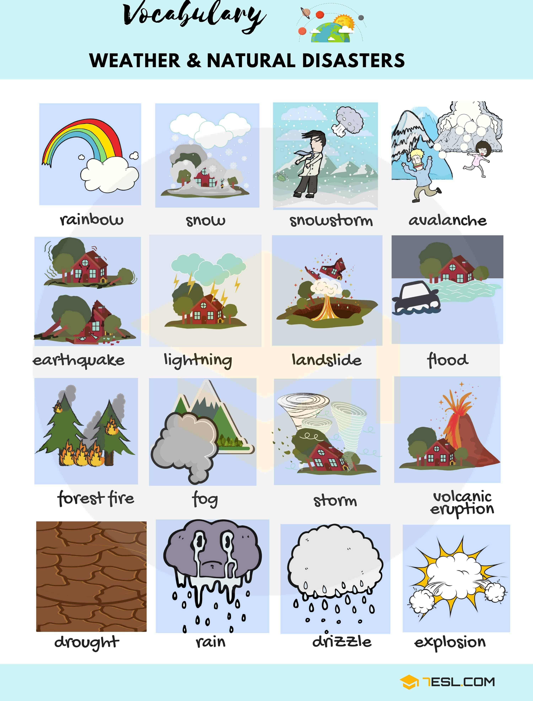
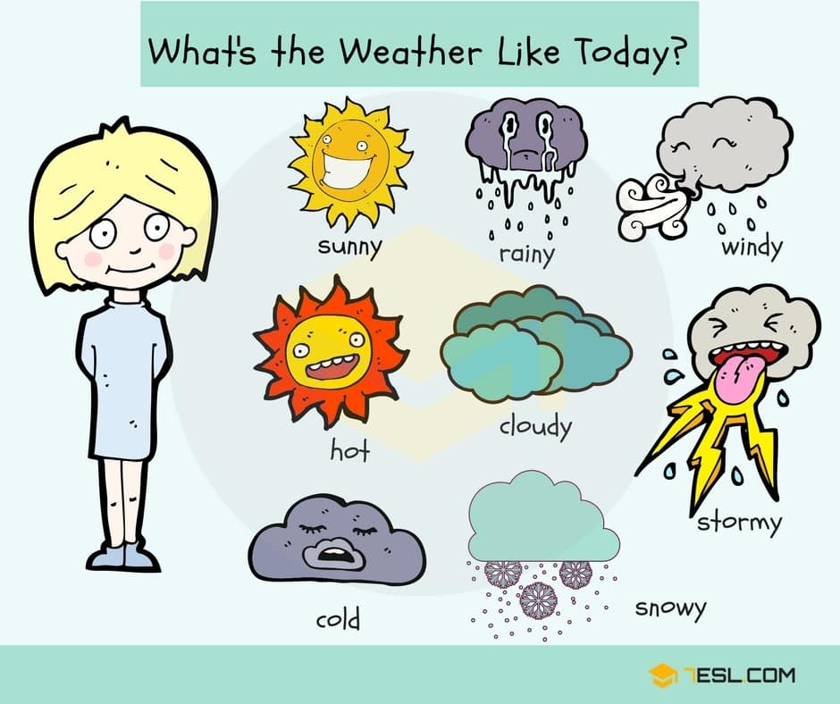

# Common Verbs 

## Spring

Word | IPA
------------ | -------------
Holiday
Rainbow
Rain
Butterfly
Flowers
Grass
Ladybird (U.K)/ ladybug (U.S)
Mushroom
Nest
Bird
Bee

## Summer

Word | IPA
------------ | -------------
Beach
Camping
Bikini
Drink
Sunglasses
Ice cream
Park
Swimming pool
Garden
Travel

## Autumn

Word | IPA
------------ | -------------
Apple harvest
Falling leaves
Pumpkin
Halloween
Back to school
Corns
Acorn

## Winter

Word | IPA
------------ | -------------
Boots
Snow
Log fire
Snowman
Socks
Skiing
Polar bear
Jacket
Scarf
Beanie (U.K)
Snowflake
Sledge (U.K)/Sled (U.S)
Mittens
Hot drink
Penguin

## Nature Vocabulary in English

Word | IPA
------------ | -------------
Canal
Bridge
Dam
Lighthouse
Island
Bay
Riverbank
Beach
Sea
Ocean
Coast
Ground
Dune
Desert
Cliff
Park
Meadow
Jungle
Forest
Glacier
Land
Hill
Field
Grass
Soil
Sea shell
Mushroom
Pebble
Rock
Stone
Smoke
Pond
River
Wave
Sky
Water
Tree
Plant
Moss
Flower
Bush
Sand
Mud
Stars
Planet
Mine
Path
Road
Tunnel
Volcano
Cave

## Space Vocabulary

Word | IPA
------------ | -------------
Mercury
Mars
Saturn
Neptune
Earth
Full Moon
Half Moon
Crescent moon
New moon
Sun
Meteor
Asteroid
Galaxy
Atmosphere

## Natural Disasters

Word | IPA
------------ | -------------
Snow
Snowstorm
Avalanche
Flood
Landslide
Lightening
Earthquake
Forest fire
Fog
Storm
Volcanic eruption
Drought
Rain
Drizzle
Explosion

## Weather Vocabulary

Word | IPA
------------ | -------------
Sunny
Rainy
Windy
Hot
Cloudy
Stormy
Cold
Snowy