# Animal (125 words)

## List of Pets

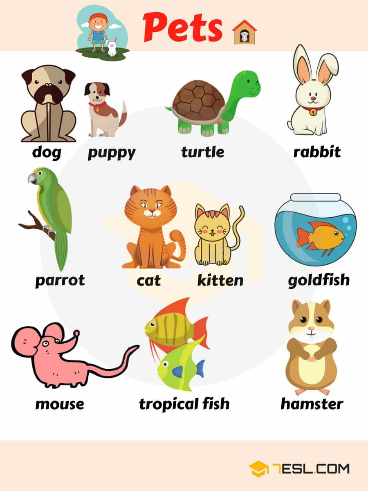

Word | IPA
------------ | -------------
Dog | /dɑːɡ/
Puppy | /ˈpʌp.i/
Turtle |  /ˈtɝː.t̬əl/
Rabbit | /ˈræb.ɪt/
Parrot | /ˈper.ət/
Cat | /kæt/
Kitten | /ˈkɪt̬.ən/
Goldfish |   /ˈɡoʊld.fɪʃ/
Mouse |  /maʊs/
Tropical |   /ˈtrɑː.pɪ.kəl/ 
fish |  /fɪʃ/
Hamster |  /ˈhæm.stɚ/    

## Farm Animal Names

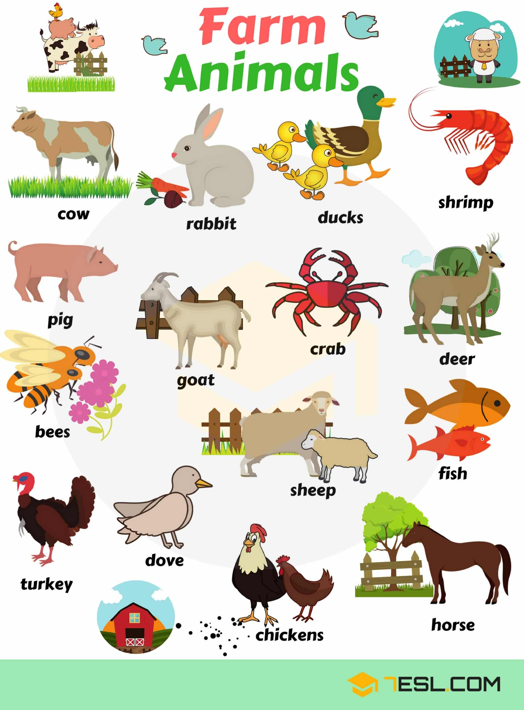

Word | IPA
------------ | -------------
Cow | /kaʊ/
Ducks | /dʌk/
Shrimp | /ʃrɪmp/
Pig | /pɪɡ/
Goat | /ɡoʊt/
Crab | /kræb/
Deer | /dɪr/
Bee | /biː/
Sheep | /ʃiːp/
Dove | /dʌv/
Chicken | /ˈtʃɪk.ɪn/
Horse | /hɔːrs/
  
## List of Birds

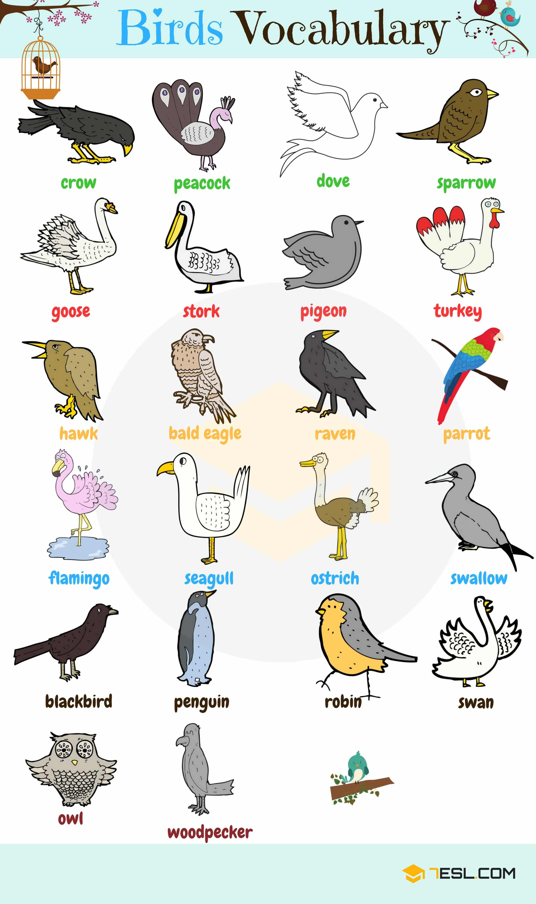

Word | IPA
------------ | -------------
Crow | /kroʊ/
Peacock | /ˈpiː.kɑːk/
Dove | /dʌv/
Sparrow | /ˈsper.oʊ/
Goose | /ɡuːs/
Stork | /stɔːrk/
Pigeon | /ˈpɪdʒ.ən/
Turkey | /ˈtɝː.ki/
Hawk | /hɑːk/
Bald eagle | /bɑːld ˈiː.ɡəl/
Raven | /ˈreɪ.vən/
Flamingo  | /fləˈmɪŋ.ɡoʊ/
Seagull | /ˈsiː.ɡʌl/
Ostrich | /ˈɑː.strɪtʃ/
Swallow | /ˈswɑː.loʊ/
Black bird | /bɝːd/
Penguin | /ˈpeŋ.ɡwɪn/
Robin | /ˈrɑː.bɪn/
Swan | /swɑːn/
Owl | /aʊl/
Woodpecker | /ˈwʊdˌpek.ɚ/

## Mammal Animal Names 

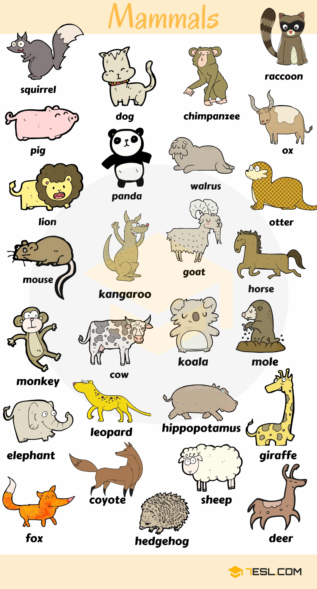

Word | IPA
------------ | -------------
Squirrel | /ˈskwɝː.əl/
Chimpanzee | /tʃɪm.pænˈziː/
Ox | /ɑːks/
Lion | /ˈlaɪ.ən/
Panda | /ˈpæn.də/
Walrus | /ˈwɑːl.rəs/
Otter | /ˈɑː.t̬ɚ/
Kangaroo | /ˌkæŋ.ɡəˈruː/
Horse | /hɔːrs/
Monkey | /ˈmʌŋ.ki/
Koala | /koʊˈɑː.lə/
Mole | /moʊl/
Elephant | /ˈel.ə.fənt/
Leopard | /ˈlep.ɚd/
Hippopotamus | /hɪp.əˈpɑː.t̬ə.məs/
Giraffe | /dʒɪˈræf/
Fox | /fɑːks/
Coyote | /kaɪˈoʊ.t̬i/
Hedgehog | /ˈhedʒ.hɑːɡ/

## Wild Animal Names

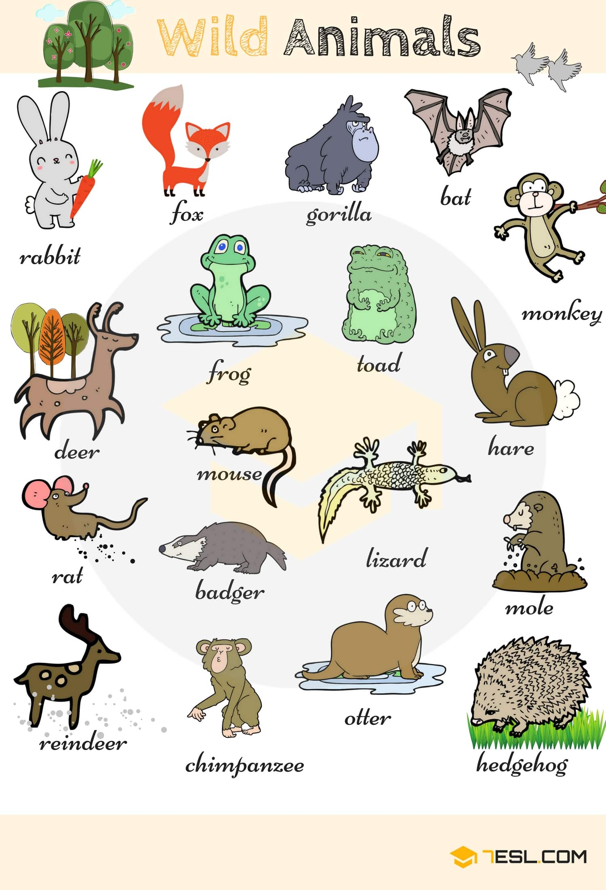

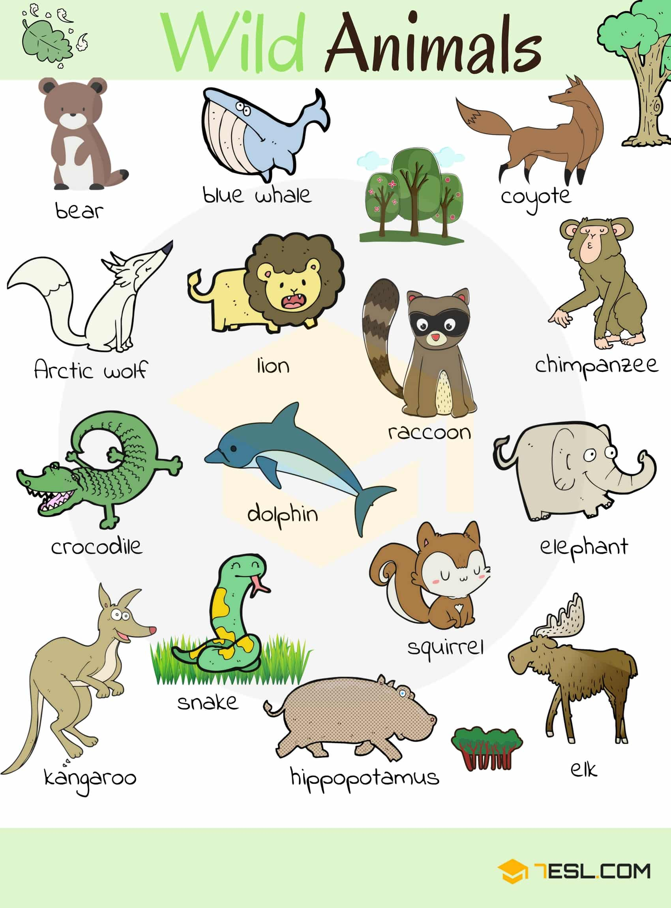

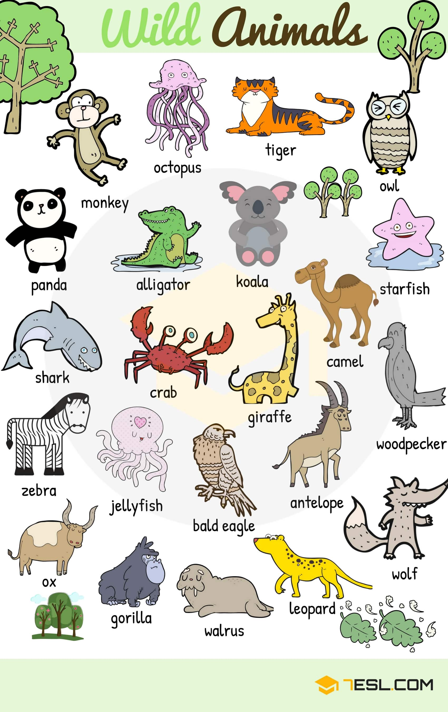

Word | IPA
------------ | -------------
Giraffe | /dʒɪˈræf/
Camel | /ˈkæm.əl/
Starfish | /ˈstɑːr.fɪʃ/
Koala | /koʊˈɑː.lə/
Alligator | /ˈæl.ə.ɡeɪ.t̬ɚ/
Tiger | /ˈtaɪ.ɡɚ/
Bear | /ber/
Blue whale | /weɪl/
Coyote | /kaɪˈoʊ.t̬i/
Raccoon | /rækˈuːn/
Wolf | /wʊlf/
Crocodile | /ˈkrɑː.kə.daɪl/
Dolphin | /ˈdɑːl.fɪn/
Elephant | /ˈel.ə.fənt/
Snake | /sneɪk/
Kangaroo | /kæŋ.ɡəˈruː/
Hippopotamus | /hɪp.əˈpɑː.t̬ə.məs/
Elk | /elk/
Gorilla | /ɡəˈrɪl.ə/
Bat | /bæt/
Hare | /her/
Toad | /toʊd/
Frog | /frɑːɡ/
Rat | /ræt/
Badger | /ˈbædʒ.ɚ/
Lizard | /ˈlɪz.ɚd/
Mole | /moʊl/
Hedgehog | /ˈhedʒ.hɑːɡ/
Reindeer | /ˈreɪn.dɪr/

## Sea Animal Names

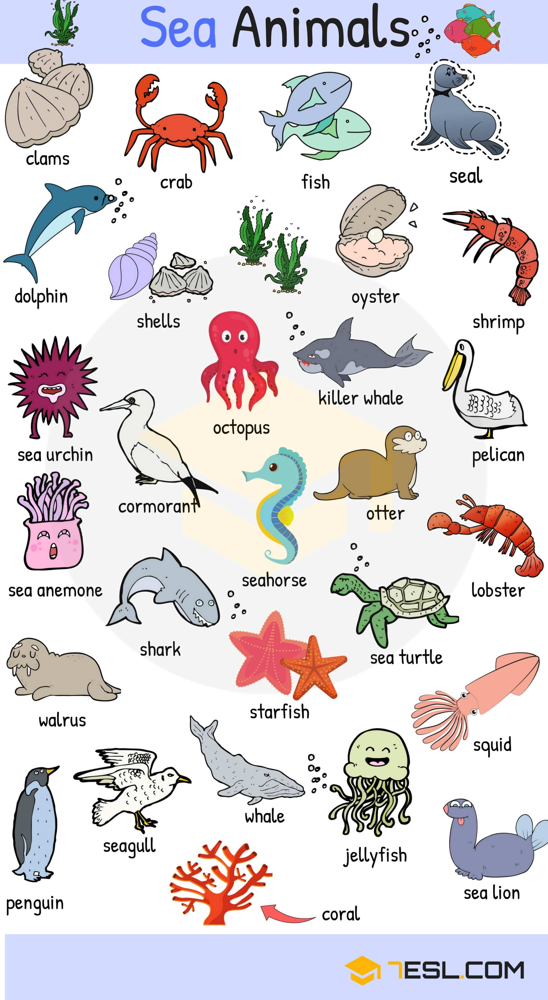

Word | IPA
------------ | -------------
Seal | /siːl/
Octopus | /ˈɑːk.tə.pəs/
Shark | /ʃɑːrk/
Seahorse | /ˈsiː.hɔːrs/
Starfish | /ˈstɑːr.fɪʃ/
Whale | /weɪl/
Jellyfish | /ˈdʒel.i.fɪʃ/
Squid | /skwɪd/
Lobster | /ˈlɑːb.stɚ/
Clams | /klæm/
Dolphin | /ˈdɑːl.fɪn/
Shells | /ʃel/
Sea urchin | /ˈɝː.tʃɪn/
Cormorant | /ˈkɔːr.mɚ.ənt/
Otter | /ˈɑː.t̬ɚ/
Pelican | /ˈpel.ə.kən/
Sea anemone | /əˈnem.ə.ni/
Coral | /ˈkɔːr.əl/

## Names of Insects

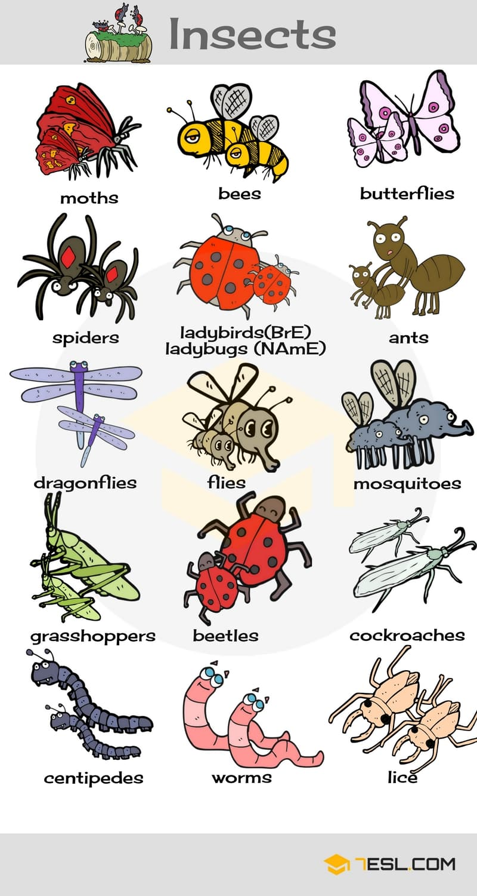

Word | IPA
------------ | -------------
Moth | /mɑːθ/
Butterfly | /ˈbʌt̬.ɚ.flaɪ/
Spider | /ˈspaɪ.dɚ/
Ladybird (BrE) – ladybug (NAmE) | /ˈleɪ.di.bɝːd/
Ant | /ænt/
Dragonfly | /ˈdræɡ.ən.flaɪ/
Fly | /flaɪ/
Mosquito | /məˈskiː.t̬oʊ/
Grasshopper | /ˈɡræsˌhɑː.pɚ/
Beetle | /ˈbiː.t̬əl/
Cockroach | /ˈkɑːk.roʊtʃ/
Centipede | /ˈsen.t̬ə.piːd/
Worm | /wɝːm/
Louse | /laʊs/
 
## Male, Female and Baby Animal Names

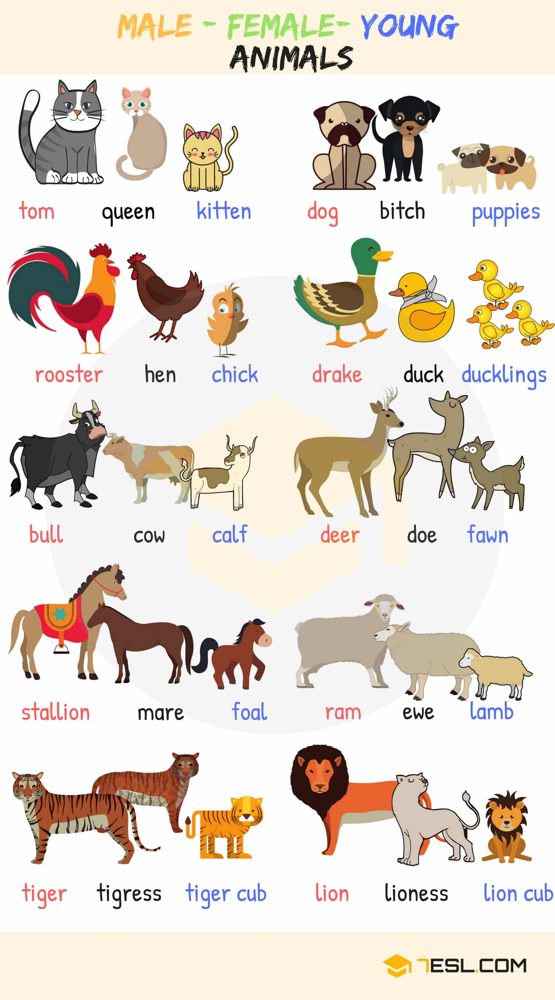

## Names of Animal Groups Image

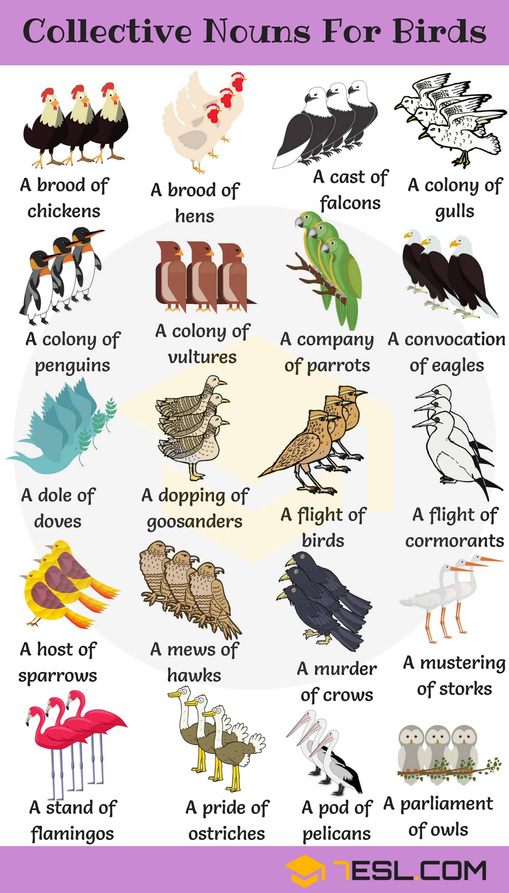

