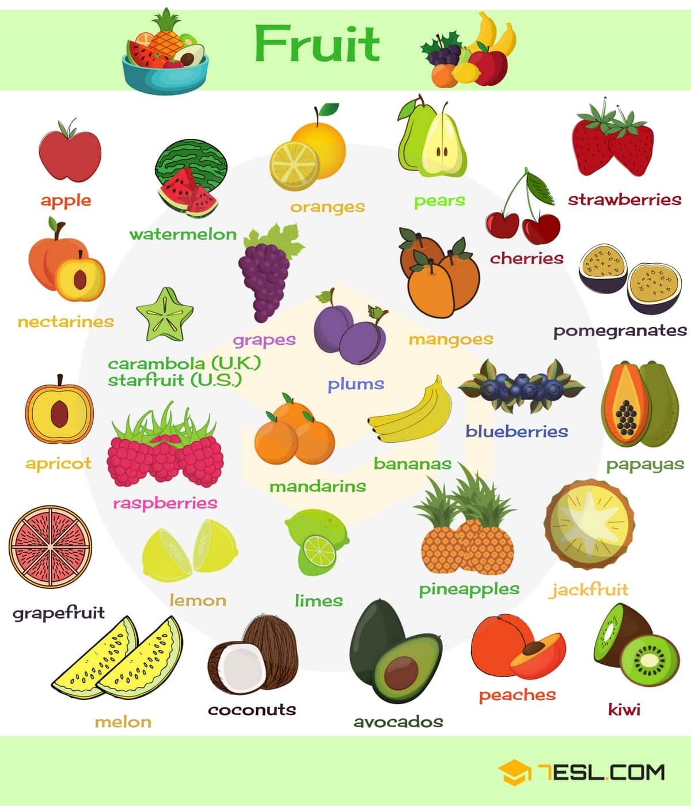
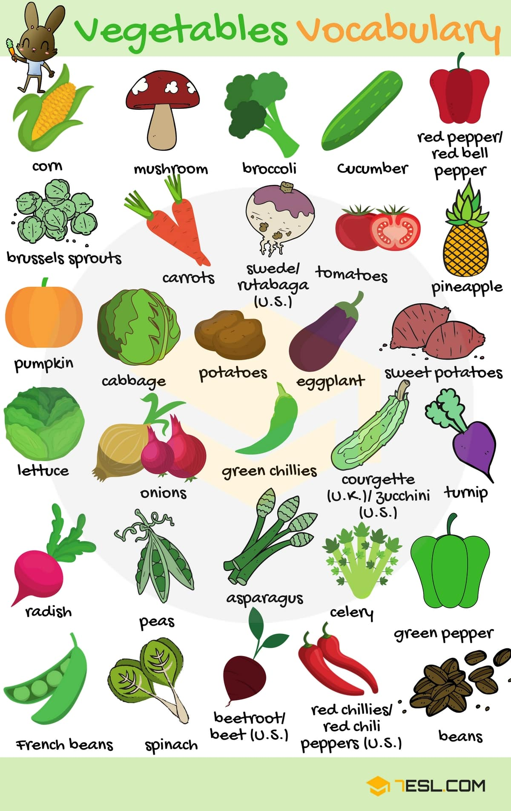
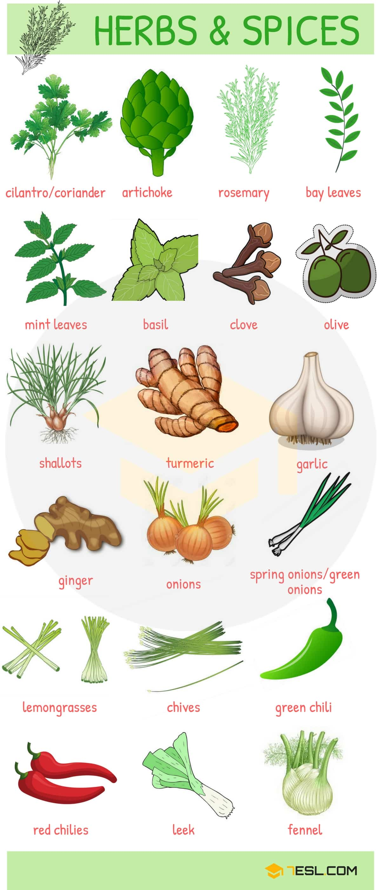

# Fruits and Vegetables (76 words)

## Fruits

Word | IPA
------------ | -------------
Apple | /ˈæp.əl/
Watermelon | /ˈwɑː.t̬ɚˌmel.ən/
Orange | /ˈɔːr.ɪndʒ/
Pear | /per/
Cherry | /ˈtʃer.i/
Strawberry | /ˈstrɑːˌber.i/
Nectarine | /ˌnek.təˈriːn/
Grape | /ɡreɪp/
Mango | /ˈmæŋ.ɡoʊ/
Blueberry | /ˈbluːˌbər.i/
Pomegranate | /ˈpɑː.məˌɡræn.ɪt/
starfruit (U.S) | /ˈstɑːr.fruːt/
Plum | /plʌm/
Banana | /bəˈnæn.ə/
Raspberry | /ˈræz.ber.i/
Mandarin | /ˈmæn.dɚ.ɪn/
Jackfruit | /ˈdʒæk.fruːt/
Papaya | /pəˈpaɪ.ə/
Kiwi | /ˈkiː.wiː/
Pineapple | /ˈpaɪnˌæp.əl/
Lime | /laɪm/
Lemon | /ˈlem.ən/
Apricot | /ˈeɪ.prɪ.kɑːt/
Grapefruit | /ˈɡreɪp.fruːt/
Melon | /ˈmel.ən/
Coconut | /ˈkoʊ.kə.nʌt/
Avocado | /ˌæv.əˈkɑː.doʊ/
Peach | /piːtʃ/

## Vegetables

Word | IPA
------------ | -------------
Corn | /kɔːrn/
Mushroom | /ˈmʌʃ.ruːm/
Broccoli | /ˈbrɑː.kəl.i/
Cucumber | /ˈkjuː.kʌm.bɚ/
Red pepper/red bell pepper | /ˈpep.ɚ/
Tomato | /təˈmeɪ.t̬oʊ/
Swede/rutabaga (U.S.) | /swiːd/
Carrot | /ˈker.ət/
Brussels sprout | /ˈbrʌs.əlz spraʊt/
Pumpkin | /ˈpʌmp.kɪn/
Cabbage | /ˈkæb.ɪdʒ/
Potato | /pəˈteɪ.t̬oʊ/
Eggplant | /ˈeɡ.plænt/
Sweet potato | /swiːt/
Turnip | /ˈtɝː.nɪp/
zucchini (U.S.) | /zuːˈkiː.ni/
Green chilli | /ˈtʃɪl.i/
Onion | /ˈʌn.jən/
Lettuce | /ˈlet̬.ɪs/
Radish | /ˈræd.ɪʃ/
Pea | /piː/
Asparagus | /əˈsper.ə.ɡəs/
Celery | /ˈsel.ɚ.i/
Spinach | /ˈspɪn.ɪtʃ/
Beetroot/beet (U.S.) | /ˈbiːt.ruːt/
Red chillies/red chili peppers (U.S.) | /ˈtʃɪl.i/
Bean | /biːn/

## Herbs & Spices

Word | IPA
------------ | -------------
Cilantro/coriander | /səˈlæn.troʊ/
Artichoke | /ˈɑːr.t̬ə.tʃoʊk/
Rosemary | /ˈroʊz.mer.i/
Bay leaves | /ˈbeɪ ˌliːf/
Mint leaves | /mɪnt/
Basil | /ˈbeɪ.zə/
Clove | /kloʊv/
Olive | /ˈɑː.lɪv/
Shallot | /ʃəˈlɑːt/
Turmeric | /ˈtɝː.mər.ɪk/
Garlic | /ˈɡɑːr.lɪk/
Ginger | /ˈdʒɪn.dʒɚ/
Onion | /ˈʌn.jən/
Spring onions/green onions | /ˈʌn.jən/
Lemon grass | /ˈlem.ən ˌɡræs/
Chives | /tʃaɪvz/