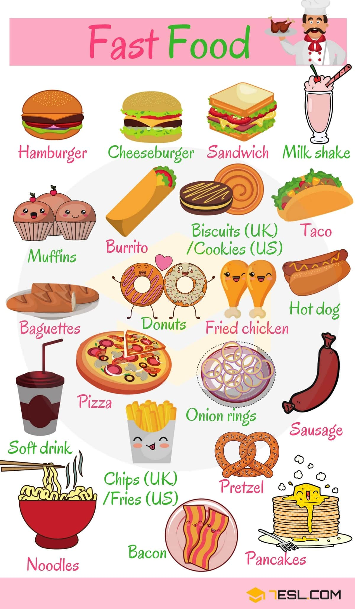
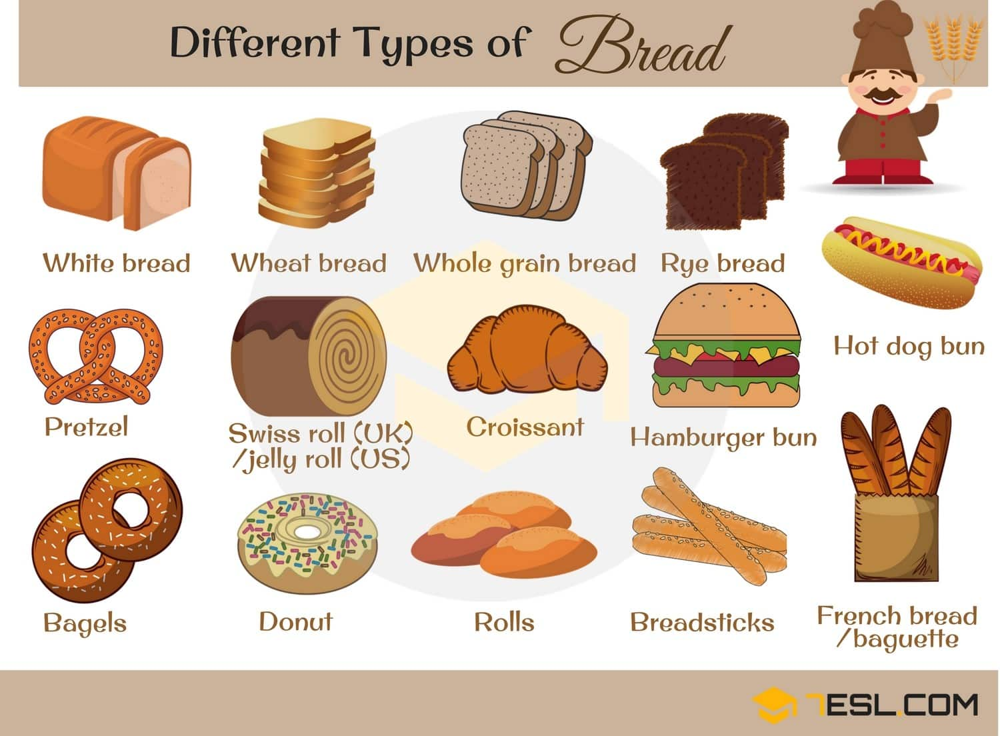
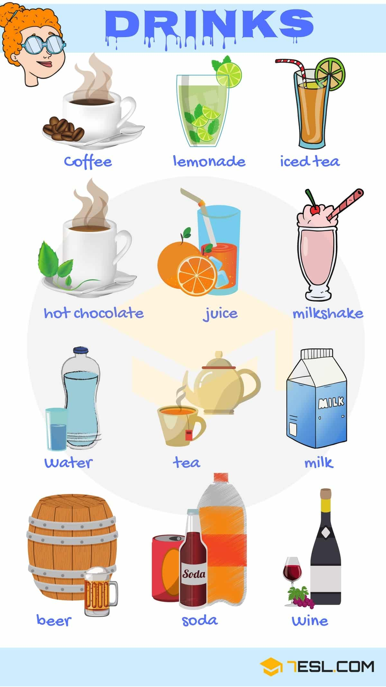
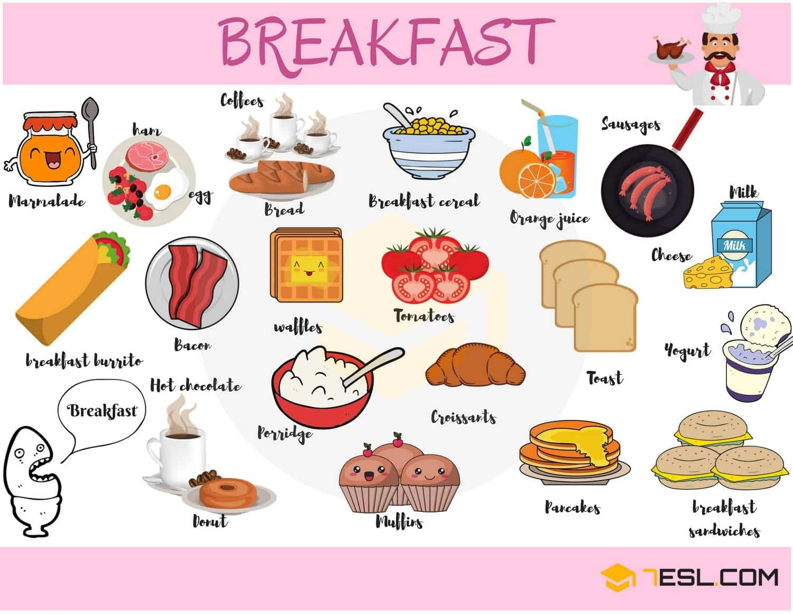
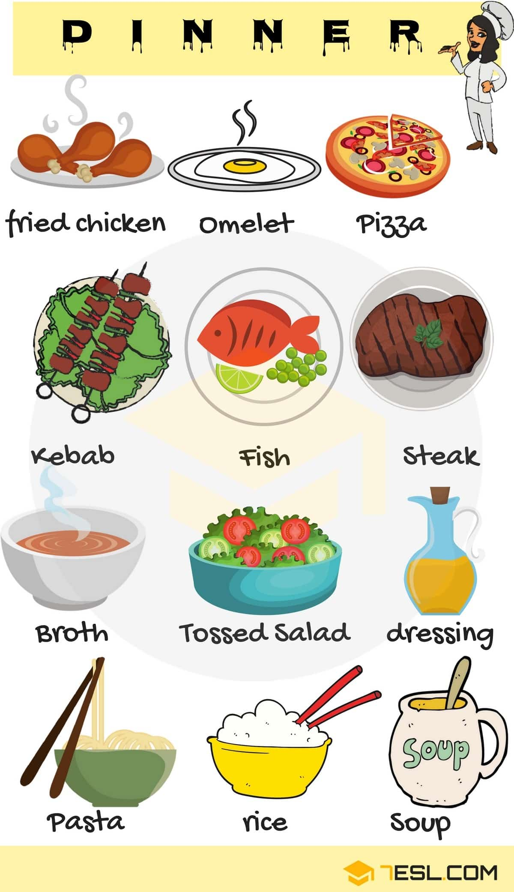

# Types of Food and Drinks (98 words)

## Fast Food Vocabulary

Word | IPA
------------ | -------------
Fish and chips | /tʃɪps/
Sandwich | /ˈsæn.wɪtʃ/   
Pita | /ˈpɪt̬.ə/
Hamburger | /ˈhæmˌbɝː.ɡɚ/
Fried chicken | /fraɪd/
French fries | /fraɪz/
Onion ring | /ˈʌn.jən ˌrɪŋ/
Chicken nugget | /ˈnʌɡ.ɪt/
Taco | /ˈtɑː.koʊ/
Pizza | /ˈpiːt.sə/
Hot dog | /hɑːt/
Ice cream | /ˈaɪs ˌkriːm/
Salad | /ˈsæl.əd/

## Types of Bread

Word | IPA
------------ | -------------
White bread | /bred/
Wheat bread | /wiːt/
Whole grain bread | /ˈhoʊl.ɡreɪn/
Rye bread | /raɪ/
Hot dog bun | /bʌn/
Hamburger bun | /bʌn/
Croissant | /kwɑːˈsɑ̃ː/
jelly roll (U.S) | /ˈdʒel.i ˌroʊl/
Pretzel | /ˈpret.səl/
Bagel | /ˈbeɪ.ɡəl/
Donut | /ˈdoʊ.nʌt/
Roll | /roʊl/
Breadstick | /ˈbred.stɪk/
French bread/ baguette | /bæɡˈet/

## Drinks

Word | IPA
------------ | -------------
Wine
Coffee
Lemonade
Iced tea
Hot chocolate
Juice
Milkshake
Water
Tea
Milk
Beer
Soda
Tea bag
Green tea
Chocolate milk
Hot chocolate
Tomato juice
Smoothie
Coconut milk
Orange juice
Lemonade
Fruit juice
Cocoa
Water

## Breakfast Food

Word | IPA
------------ | -------------
Marmalade
Ham
Egg
Bread
Breakfast burrito
Hot chocolate
Bacon
Donut
Porridge
Muffin
Waffle
Tomato
Croissant
Pancake
Toast
Breakfast sandwich
Yogurt
Cheese
Milk
Sausage
Orange juice
Breakfast cereal
Coffee

## Dinner Food

Word | IPA
------------ | -------------
Fried chicken
Omelet
Pizza
Kebab
Fish
Steak
Broth
Tossed salad
Dressing
Pasta
Rice
Soup
