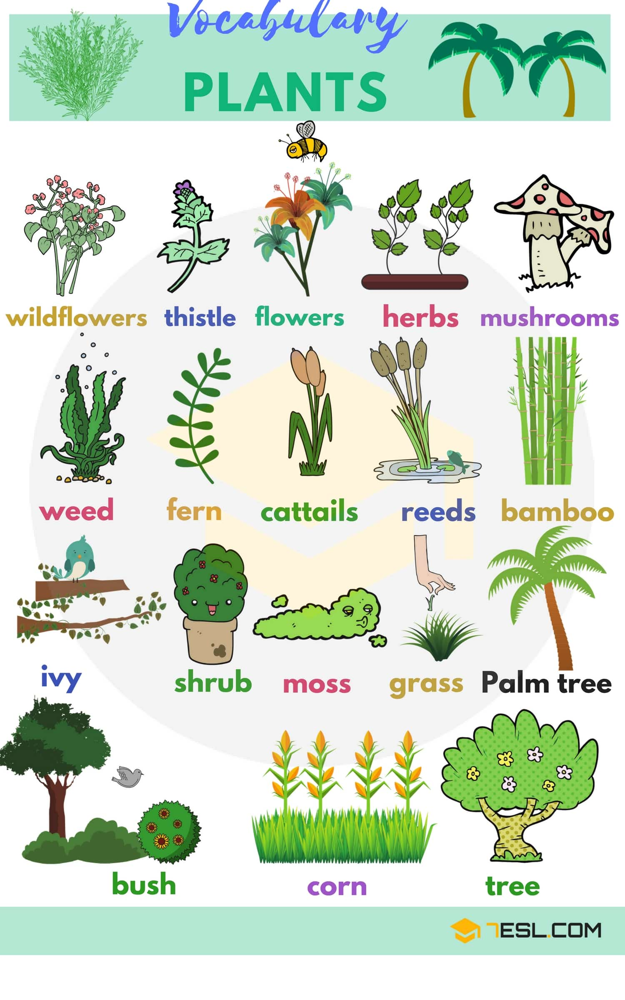
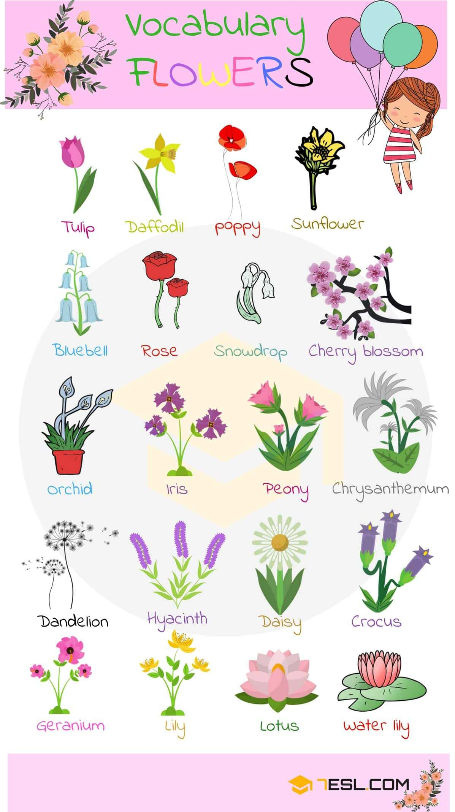
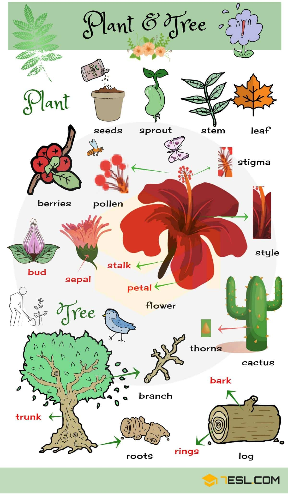

# Plant and Flower (58 words)

## Types of Plants

Word | IPA
------------ | -------------
Wildflower
Thistle
Flower
Herb
Mushroom
Weed
Fern
Cattail
Reed
Bamboo
Ivy
Shrub
Moss
Grass
Palm tree
Bush
Corn
Tree

## Flowers Names

Tulip
Daffodil
Poppy
Sunflower
Bluebell
Rose
Snowdrop
Cherry blossom
Orchid
Iris
Peony
Chrysanthemum
Geranium
Lily
Lotus
Water lily
Dandelion
Hyacinth
Daisy
Crocus

## Parts of A Plant, Tree

Parts of a Plant Vocabulary

    Seed
    Sprout
    Stem
    Leaf
    Berry
    Bud
    Flower

Parts of a Flower Vocabulary

    Pollen
    Stigma
    Sepal
    Stalk
    Petal

Parts of a Tree Vocabulary

    Trunk
    Branch
    Root
    Ring
    Thorn
    Bark
    Log

