# Clothes Vocabulary (115 words)

## Clothes and Accessories

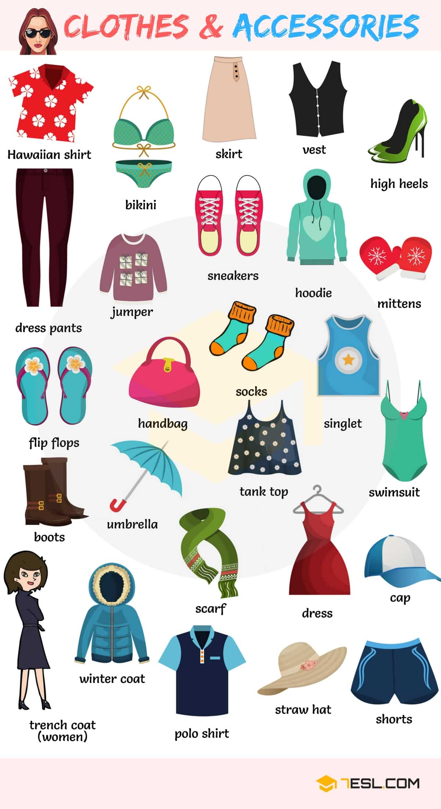

Word | IPA
------------ | -------------
Skirt
Bikini
Dress pants
Jumper
Sneakers
Hoodie
Vest
High heels
Flip flops
Handbag
Tank top
Singlet
Boots
Shorts
Polo shirt
Umbrella
Dress
Hawaiian shirt
Mittens
Socks
Swimsuit
Trench coat
Winter coat
Straw hat
Cap
Scarf

## Accessories Names

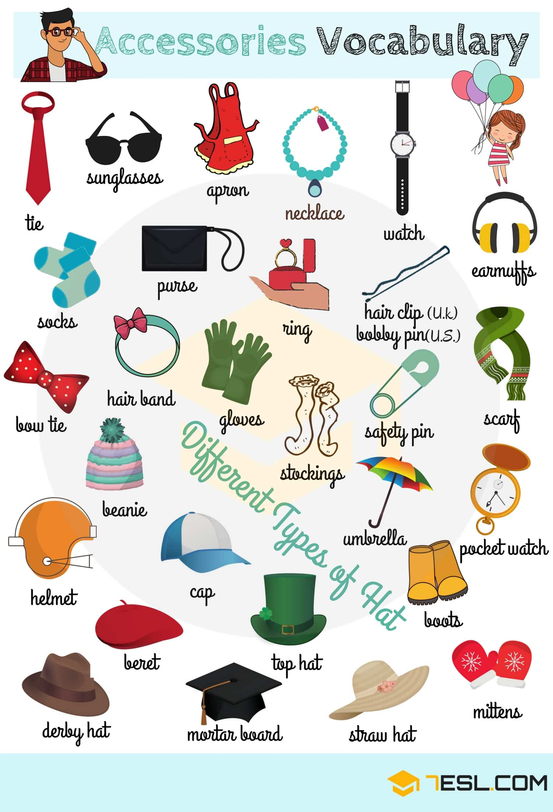

Word | IPA
------------ | -------------
Sunglasses
Apron
Necklace
Watch
Socks
Tie
Bow tie
Purse
Ring
Gloves
Scarf
Umbrella
Boots
Mittens
Stockings
Earmuffs
Hair clip (U.K) – Bobby pin (U.S)
Hair band
Safety pin
Pocket watch
Beanie
Cap
Beret
Straw hat
Derby hat
Helmet
Top hat
Mortar board

## Baby Clothes

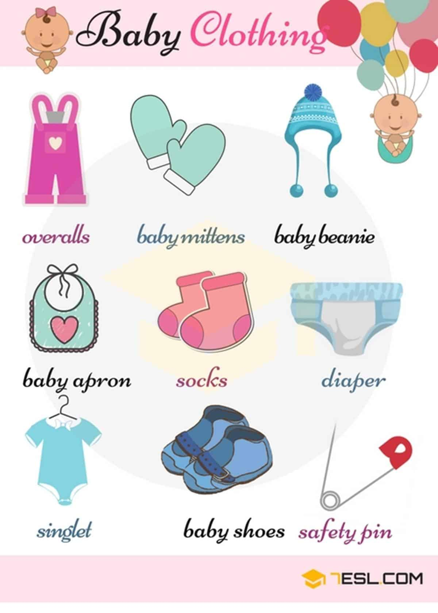

Word | IPA
------------ | -------------
Overalls
Mittens
Beanie
Baby apron
Socks
Diaper
Singlet
Shoes
Safety pin

## List of Men’s Clothes

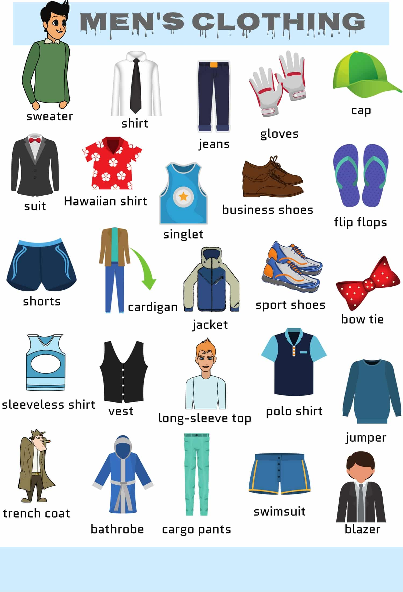
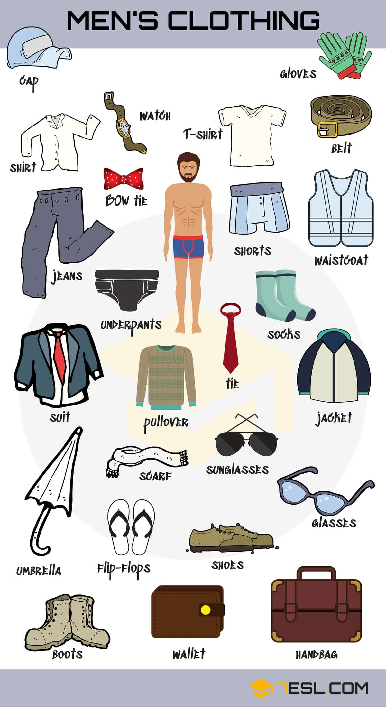

Word | IPA
------------ | -------------
Sweater
Shirt
Jeans
Gloves
Cap
Suit
Hawaiian shirt
Singlet
Business shoes
Flip flops
Shorts
Cardigan
Jacket
Sport shoes
Bow tie
Sleeveless shirt
Vest
Long-sleeve top
Polo shirt
Jumper
Trench coat
Bathrobe
Cargo pants
Swimsuit
Blazer
T-shirt
Belt
Underpants
Waistcoat
Socks
Tie
Pullover
Umbrella
Scarf
Sunglasses
Glasses
Boots
Wallet
Handbag
Watch

## Women’s Clothes Vocabulary

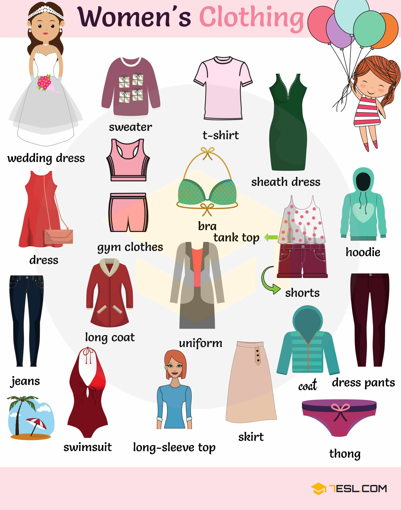
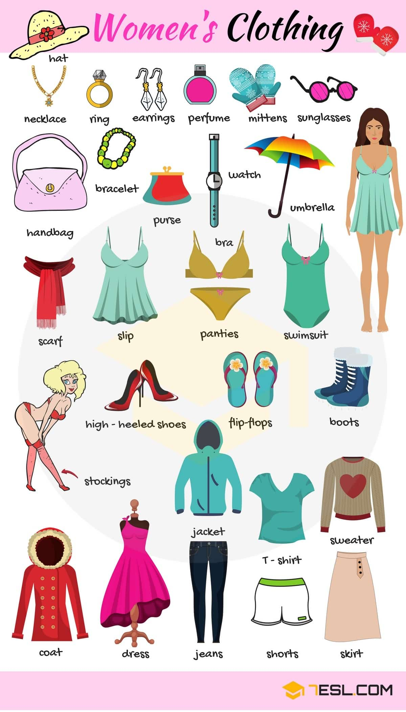

Word | IPA
------------ | -------------
Wedding dress
Sweater
T-shirt
Sheath dress
Dress
Gym clothes
Bra
Tank top
Shorts
Hoodie
Jeans
Long coat
Uniform
Coat
Dress pants
Swimsuit
Long-sleeve top
Skirt
Thong
Hat
Necklace
Ring
Earrings
Perfume
Mittens
Sunglasses
Handbag
Bracelet
Purse
Watch
Umbrella
Scarf
Slip
High-heeled shoes
Flip-flops
Boots
Stockings
Jacket

## Winter Clothes Names

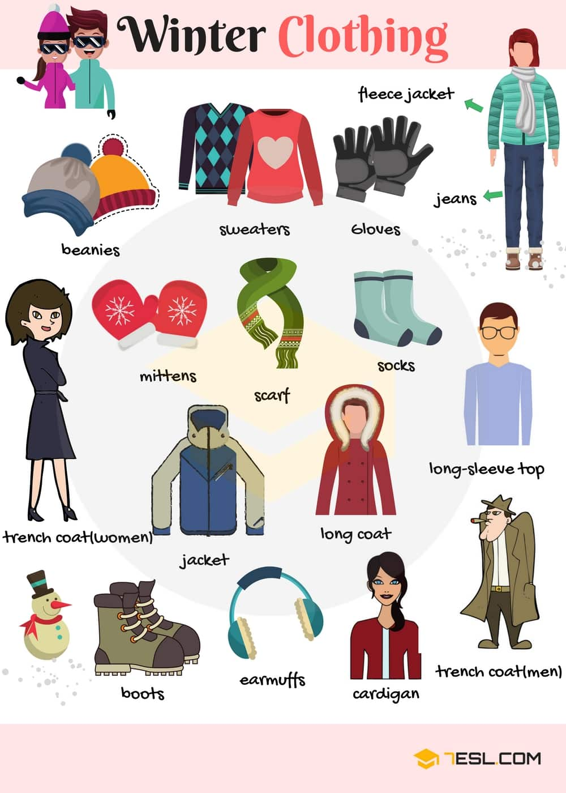

Word | IPA
------------ | -------------
Beanie
Sweater
Gloves
Fleece jacket
Jeans
Mittens
Scarf
Socks
Trench coat
Jacket
Long coat
Long-sleeve top
Boots
Earmuffs
Cardigan

## Summer Clothes in English

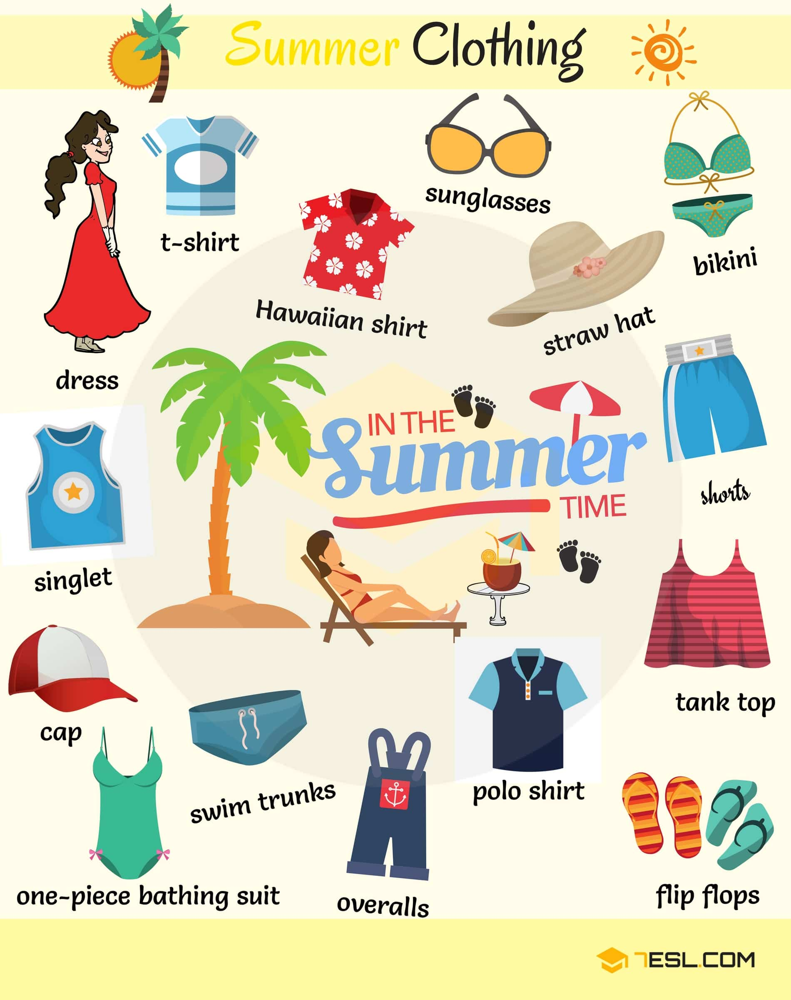

Word | IPA
------------ | -------------
T-shirt
Dress
Singlet
Cap
One-piece bathing suit
Hawaiian shirt
Sunglasses
Swim trunks
Straw hat
Polo shirt
Overalls
Bikini
Shorts
Tank top
Flip flops

## Makeup and Cosmetics

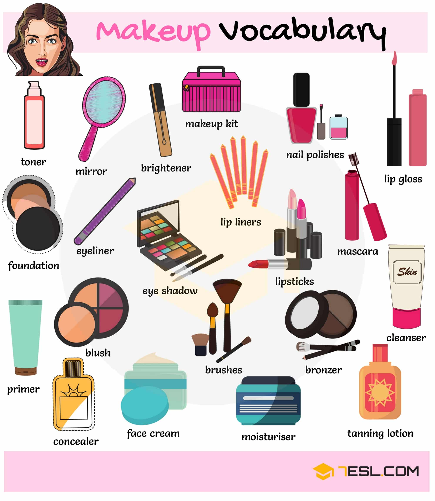

Word | IPA
------------ | -------------
Toner
Mirror
Brightener
Makeup kit
Nail polish
Lip gloss
Lip liner
Foundation
Eyeliner
Eye shadow
Lipstick
Mascara
Cleanser
Tanning lotion
Bronzer
Moisturizer
Face cream
Concealer
Primer
Blush
Brush

## Personal Care Products

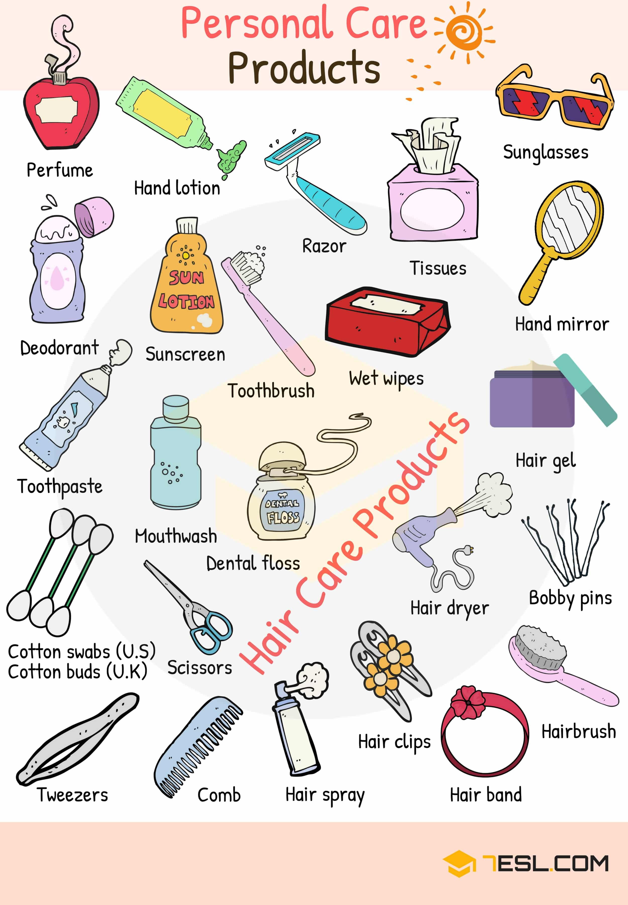

Word | IPA
------------ | -------------
Perfume
Hand lotion
Razor
Tissues
Sunglasses
Hand mirror
Wet wipe
Toothbrush
Sunscreen
Deodorant
Toothpaste
Cotton swab (U.S) – cotton bud (U.K)
Tweezers
Scissors
Mouthwash
Dental floss
Comb
Hair spray
Hair clip
Hair band
Hairbrush
Bobby pin
Hair dryer
Hair gel
