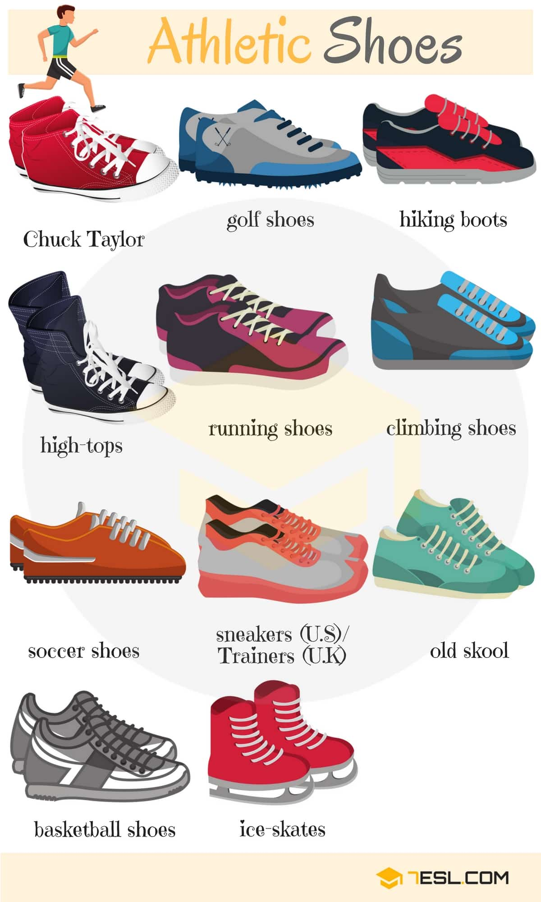
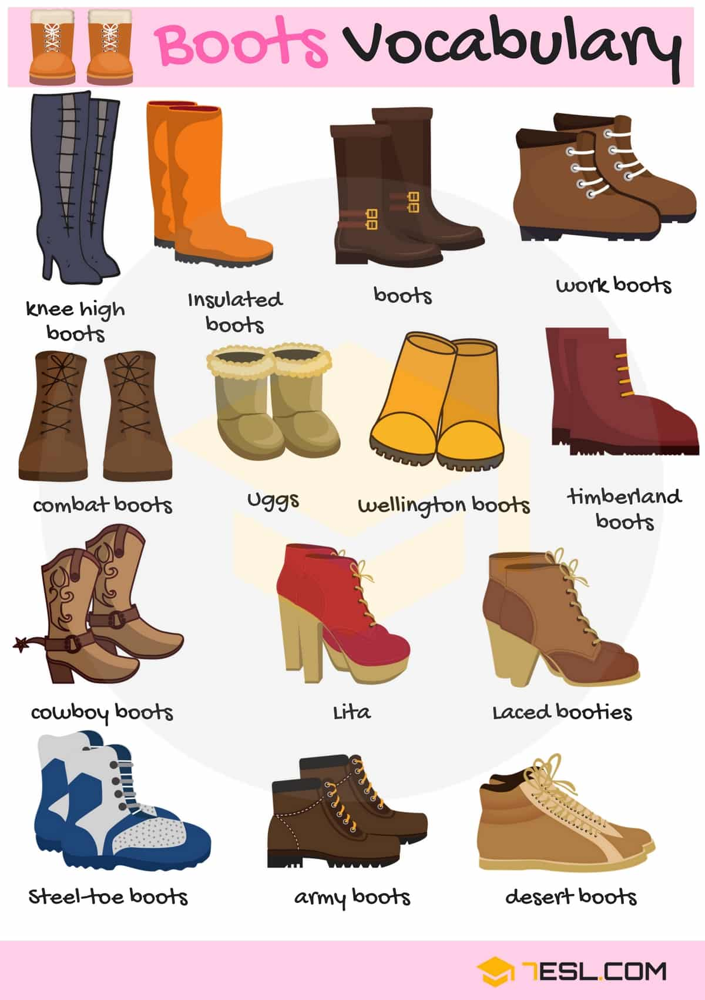
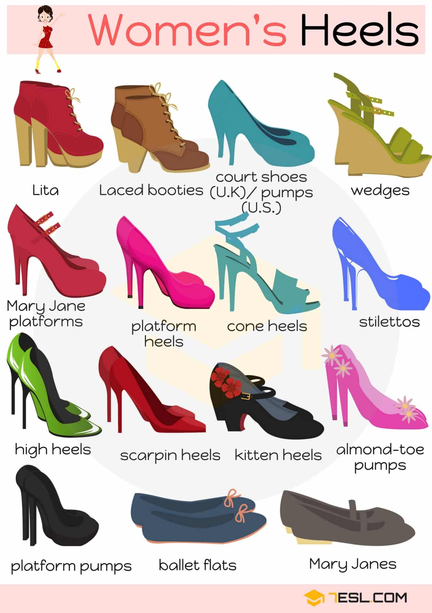
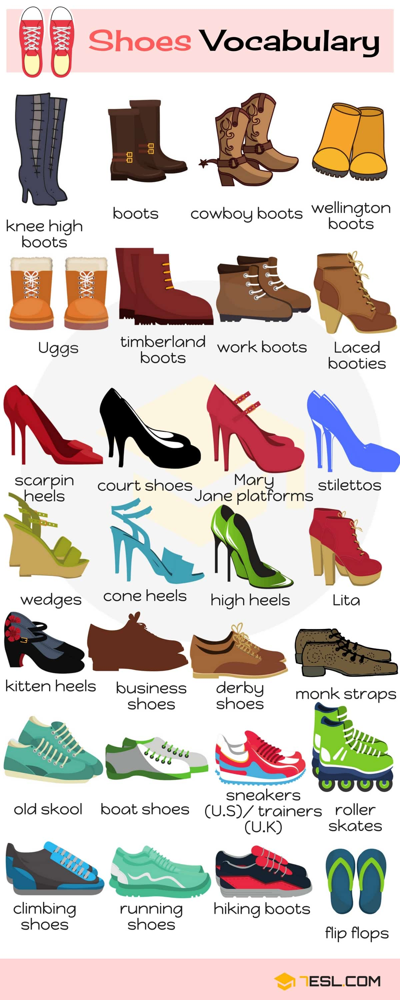

# Types of Shoes (68 words)

## Athletic Shoe Types

Word | IPA
------------ | -------------
Chuck Taylor
Golf shoes
Hiking boots
High-tops
Running shoes
Climbing shoes
Soccer shoes
Sneakers (U.S)/ Trainers (U.K)
Old skool
Basketball shoes
Ice-skates

## Boots Vocabulary

Word | IPA
------------ | -------------
Knee high boots
Insulated boots
Boots
Work boots
Combat boots
Uggs
Wellington boots
Timberland boots
Cowboy boots
Lita
Laced booties
Steel-toe boots
Army boots
Desert boots

## Women’s Heels

Word | IPA
------------ | -------------
Lita
Laced booties
Court shoes (U.K) – Pumps (U.S)
Wedges
Mary Jane platforms
Platform heels
Cone heels
Stilettos
High heels
Scarpin heels
Kitten heels
Almond-toe pumps
Platform pumps
Ballet flats
Mary Janes

## List of Shoes

Word | IPA
------------ | -------------
Knee high boots
Boots
Cowboy boots
Wellington boots
Uggs
Timberland boots
Work boots
Laced booties
Scarpin heels
Court shoes
Mary Jane Platforms
Stilettos
Wedges
Cone heels
High heels
Lita
Kitten heels
Business shoes
Derby shoes
Monk straps
Old skool
Boat shoes
Sneakers (U.S)/ Trainers (U.K)
Roller skates
Climbing shoes
Running shoes
Hiking boots
Flip flops

