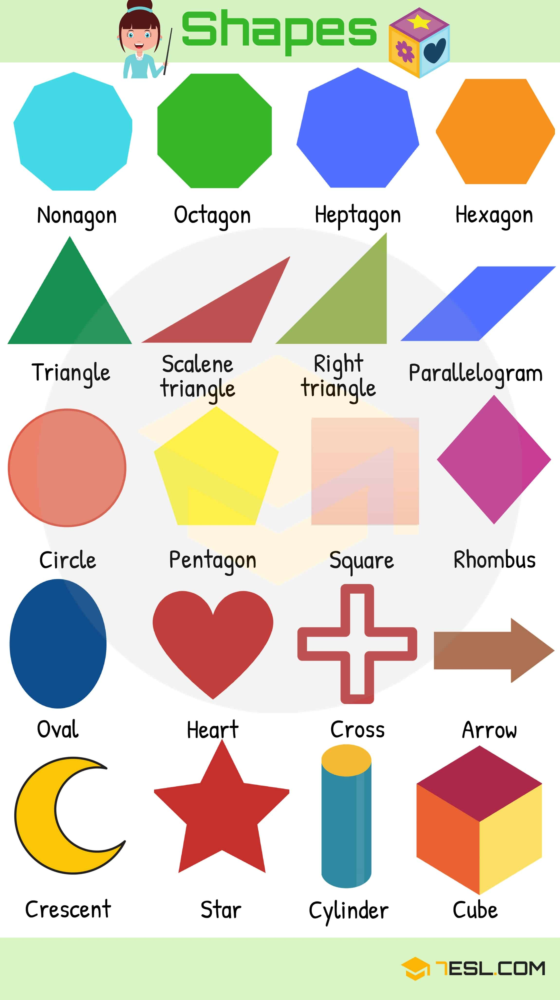
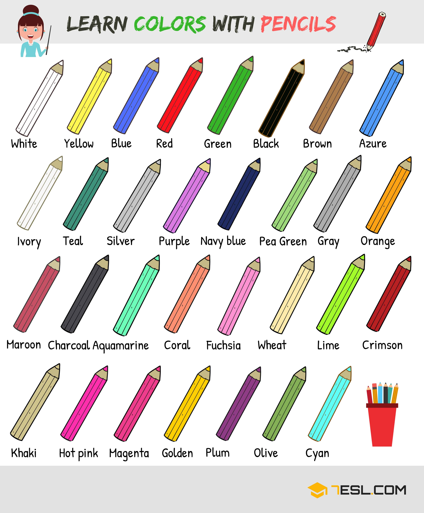

# Colours and Shapes (48 words)

## Shapes Vocabulary

Word | IPA
------------ | -------------
Octagon
Heptagon
Hexagon
Triangle
Scalene triangle
Right triangle
Parallelogram
Rhombus
Square
Pentagon
Circle
Oval
Heart
Cross
Arrow
Cube
Cylinder
Star
Crescent

## Colours Vocabulary

Word | IPA
------------ | -------------
Blue
Red
Green
Black
Brown
Azure
Ivory
Teal
Silver
Purple
Navy blue
Pea green
Gray
Orange
Maroon
Charcoal
Aquamarine
Coral
Fuchsia
Wheat
Lime
Crimson
Khaki
Hot pink
Magenta
Olden
Plum
Olive
Cyan