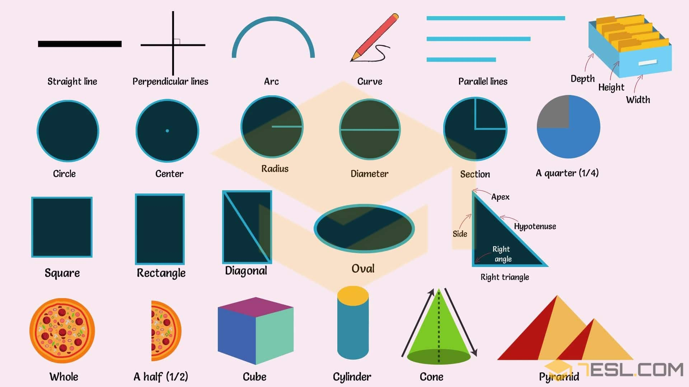
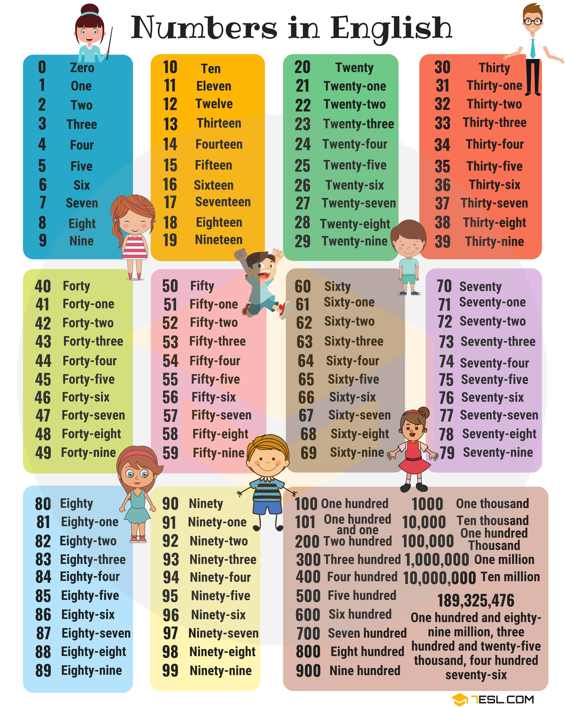

# Mathematical (68 words)

## List of Mathematics Vocabulary Words

Word | IPA
------------ | -------------
Straight line
Perpendicular
Curve
Arc
Circle
Radius
Diameter
Section
Square
Rectangle
Diagonal
Right triangle
Oval
Center
Whole
A half (1/2)
A quarter (1/4)
Cube
Cylinder
Pyramid
Cone
Parallel lines

## Mathematics Symbols

Word | IPA
------------ | -------------
Addition
Subtraction
Multiplication
Division
Plus-minus
Strict inequality
Equality
Inequation
Tilde
Congruence
Infinity
Inequality
Material equivalence
Material implication
Theta
Empty set
Triangle or delta
For all
Pi constant
Integral
Intersection
Union
Factorial
Therefore
Square root
Perpendicular
Exists
Line
Line segment
Ray
Right angle
Angle
Summation
Braces (grouping)
Brackets
Parentheses (grouping)

## Geometric Lines

Word | IPA
------------ | -------------
Straight
Diagonal
Vertical
Parallel lines
Curved
Horizontal
Dotted
Wavy
Zigzag

## Numbers 

Word | IPA
------------ | -------------

## Number Chart

