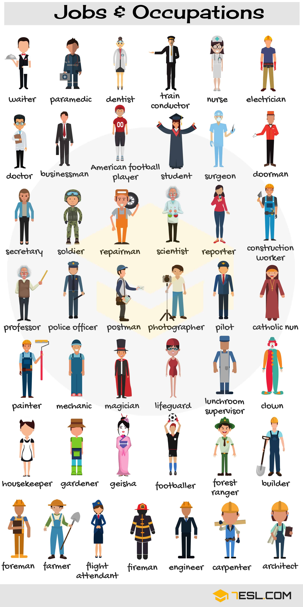
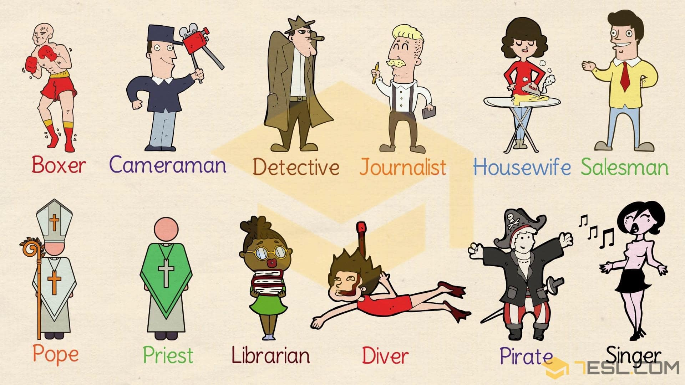

# Jobs (56 words)

## List of Mathematics Vocabulary Words

Word | IPA
------------ | -------------
Waiter
Paramedic
Dentist
Train conductor
Nurse
Electrician
Doctor
Businessman
American football player
Student
Surgeon
Doorman
Secretary
Soldier
Repairman
Scientist
Reporter
Construction worker
Professor
Police officer
Postman
Photographer
Pilot
Catholic nun
Painter
Mechanic
Magician
Lifeguard
Lunchroom supervisor
Clown
Housekeeper
Gardener
Geisha
Footballer
Forest ranger
Builder
Foreman
Farmer
Flight attendant
Fireman
Engineer
Carpenter
Architect
Boxer
Cameraman
Detective
Journalist
Housewife
Diver
Pope
Priest
Salesman
Librarian
Pirate
Singer

