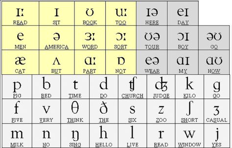

# IPA USA

## Vowel Sounds

### 1. Long e **/i:/**
- ee: keep /k**i:**p/;   free /fr**i:**/; seem /s**i:**m/
- ea: each /**i:**ʧ/;    dream /dr**i:**m/;   tea /t**i:**/
- ie_e: piece /p**i:**s/;  grieve /gr**i:**v/;  achieve /əʧ**i:**v/
- ie: brief /br**i:**f/; priest /pr**i:**st/; field /f**i:**ld/
- -y: happy /hæp**i:**/; body /bɑd**i:**/;    pony /poʊn**i:**/
- -e: me /m**i:**/;  we /w**i:**/;    she /ʃ**i:**/

### 2. short i **/ɪ/**
- -i- (CVC):  it /**ɪ**t/, lip /l**ɪ**p/, spin /sp**ɪ**n/
- -y-: myth /m**ɪ**θ/, symbol /s**ɪ**mbəl/, system /s**ɪ**stəm/

### 3. other u **/ʊ/**
- oo: good /g**ʊ**d/, look /l**ʊ**k/, book /b**ʊ**k/
- -u- (CVC): put /p**ʊ**t/, full /f**ʊ**l/, sugar /'ʃ**ʊ**g ɚ/
- -ure: pure /pj**ʊ**r/, cure /kj**ʊ**r/,  insure /in 'ʃ**ʊ**r/

### 4. oo sound **/u:/**
- oo: soon /s**uː**n/, food /f**uː**d/, school /sk**uː**l/
- u_e (VCe): rude /r**uː**d/, intrude /ɪnˈtr**uː**d/, salute /səˈl**uː**t/
- ue: clue /kl**uː**/,  true /tr**uː**/, glue /ɡl**uː**/
- ew: drew /dr**uː**/, chew /tʃ**uː**/, flew /fl**uː**/

### 5. Short e **/e/**
- -e- (CVC): bed /b**e**d/; send /s**e**nd/; yes /y**e**s/
- ea: head /h**e**d/; bread /br**e**d/; heaven /h**e**vən/
- none: said /s**e**d/; says /s**e**z/; friend  /fr**e**nd/; guest  /g**e**st/; again  /ə ˈg**e**n/

### 6. Schwa Sound /ə/ 
- 'a': again: /**ə** 'gɛn/, vitamin: /'vɑɪ t̬**ə** mɪn/
- 'e': petition: /p**ə** ˈtɪʃ **ə**n/, celebrate: /ˈsɛl **ə** breɪt/
- 'i' spelling: president: /ˈprɛz **ə** dɛnt/, experiment: /ɪk 'spɛr **ə** m**ə**nt/
- 'o' spelling: occur: /ə 'k**ɚ**/, condition: /kən ˈdɪʃ **ə**n/
- 'u' spelling: campus: /ˈkæm p**ə**s/, support: /s**ə** ˈpɔrt/

### 7. schwa+r /ɝː/
- er: her /h**ɝː**/, verb /v**ɝː**b/, after /'æft **ɝː**/
- ir: girl /g**ɝː**l/,  birth /b**ɝː**θ/, stir /st**ɝː**/
- ur: burn /b**ɝː**n/, purple /'p**ɝː**p l/, occur /ə 'k**ɝː**/
- ear:  learn /l**ɝː**n/, pearl /p**ɝː**l/, heard /h**ɝː**d/
- (w+)or: word /w**ɝː**d/,  work /w**ɝː**k/, world /w**ɝː**ld/
- vowel+r (unstressed syllable): doctor /'dɑkt **ɝː**/,  forget /f**ɝː** 'gɛt/, dollar /'dɑl **ɝː**/

### 8. or sound /ɔ:/
- or: corn /k**ɔ:**rn, north /n**ɔ:**rθ/,  short /ʃ**ɔ:**rt/
- ore: more /m**ɔ:**r/, store /st**ɔ:**r/, before /bɪ 'f**ɔ:**r/
- oar: board /b**ɔ:**rd/, roar /r**ɔ:**r/,  soar /s**ɔ:**r/
- (w+)ar:  warm /w**ɔ:**rm/, warning /w**ɔ:**rn ɪŋ/, award /ə 'w**ɔ:**rd/
- 'or sound' non-phonetic words: four, floor, door
(Non-phonetic words are not pronounced according to their spelling. Their pronunciations should be memorized.)

### 9. Short a **/æ/**
- -a- (CVC): ask /**æ**sk/; bath /b**æ**θ/; class /kl**æ**s/

### 10. short u **/ʌ/**
- -u- (CVC): us /**ʌ**s/, duck /d**ʌ**k/, just /ʤ**ʌ**st/

### 11. ar sound /ɑː/
- ar: arm /**ɑː**rm/, start /st**ɑː**rt/, car /k**ɑː**r/

### 12. short o **/ɒ/** 
- -o- (CVC): odd /**ɒ**d/, box /b**ɒ**ks/, shock /ʃ**ɒ**k/

### 13. **/ɪə/** 
- here /h**ɪə**r/

### 14. Long A  **/eɪ/** 

- a_e: same /s**eɪ**m/;    cake /k**eɪ**k/; safe /s**eɪ**f/
- -ai-: rain /r**eɪ**n/;    paid /p**eɪ**d/;    faith /f**eɪ**θ/
- ay:  say /s**eɪ**/;  play /pl**eɪ**/;    way /w**eɪ**/

### 15. **/ʊə/** 
- tour: /t**ʊə**r/

### 16. oi sound **/ɔɪ/**
- oi: oil /**ɔɪ**l/, voice /v**ɔɪ**s/, point /p**ɔɪ**nt/
- oy: boy /b**ɔɪ**/, joy /ʤ**ɔɪ**/,  loyal /'l**ɔɪ** əl/

### 17. long o **/əʊ/**
- o_e : joke /ʤ**əʊ**k/, rope /r**əʊ**p/, vote /v**əʊ**t/
- oa: boat /b**əʊ**t/, soap /s**əʊ**p/,  toast /t**əʊ**st/
- ow: snow /sn**əʊ**/, own /**əʊ**n/, known /n**əʊ**n/
- -o-: most /m**əʊ**st/, go /g**əʊ**/, both /b**əʊ**θ/

### 18. **/eə/**
- wear : w**eə**r/

### 19. long i **/ɑɪ/** 
- i_e: ice /**ɑɪ**s/, hide /h**ɑɪ**d/, smile /sm**ɑɪ**l/
- igh: light /l**ɑɪ**t/, bright /br**ɑɪ**t/, sigh /s**ɑɪ**/
- ie: tie /t**ɑɪ**/, pie /p**ɑɪ**/, die /d**ɑɪ**/
- y: shy /ʃ**ɑɪ**/, sky /sk**ɑɪ**/, dry /dr**ɑɪ**/
- -y-: cycle /s**ɑɪ**kl/, dynamic /d**ɑɪ**næmɪk/, hyper /h**ɑɪ**pɚ/

### 20. ow sound **/aʊ/**
- ow: cow /k**aʊ**/,  brown /br**aʊ**n/, owl /**aʊ**l/
- ou:  mouse /m**aʊ**s/, count /k**aʊ**nt/, out /**aʊ**t/

## Other

### long u **/ju:/**
- u_e: cute /k**ju:**t/, cube /k**ju:**b/, huge /h**ju:**ʤ/
- ue: fuel /f**ju:**l/, hue /h**ju:**/, rescue /rɛsk**ju:**/
- ew: few /f**ju:**/, pew /p**ju:**/, skew /sk**ju:**/